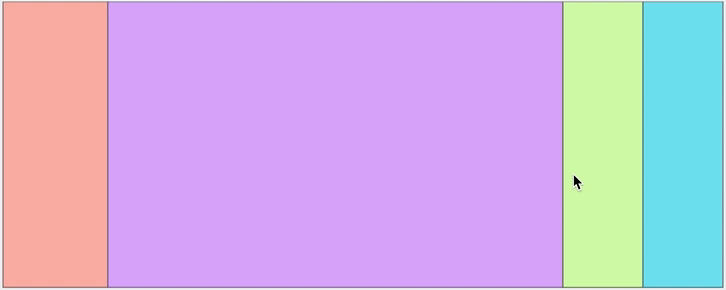
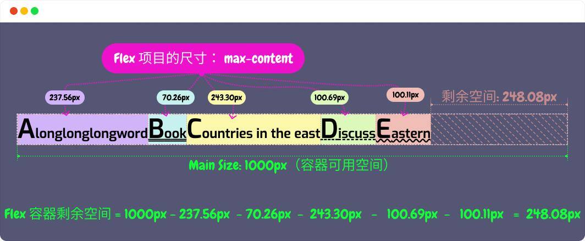
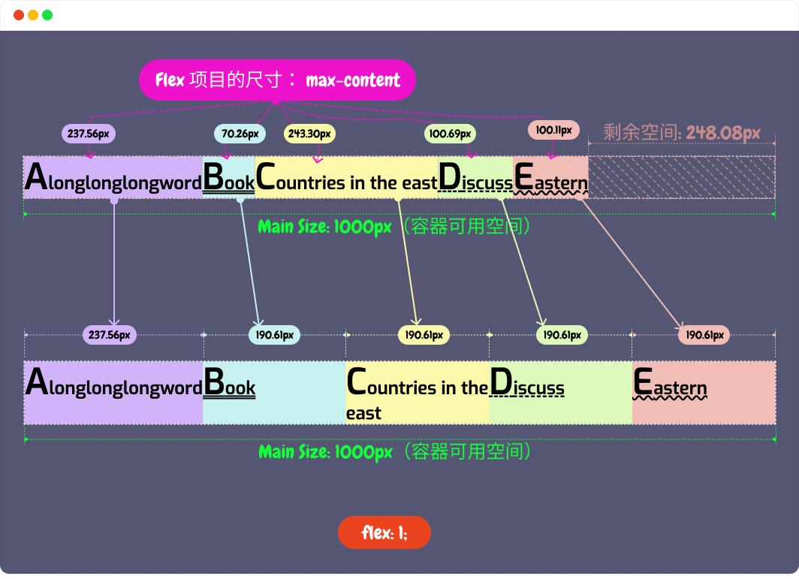
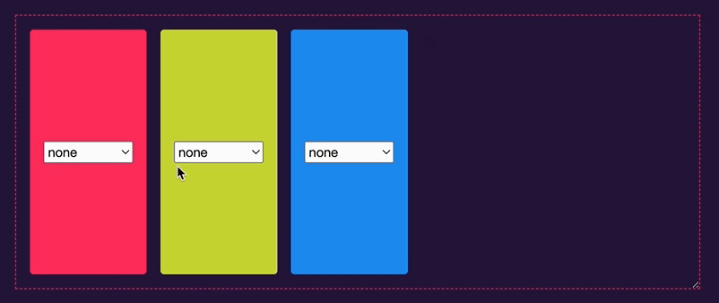

Flexbox 的设计目的是在包含元素（Flex 容器）中沿着行或列分配元素（Flex 项目）和空间。而它的最大特性就是 Flex 项目可伸缩，也就是让 Flex 项目的宽度（或高度）可以自动填充 Flex 容器剩余空间或 Flex 项目适配 Flex 容器不足的空间。而这一切都依赖于 Flexbox 模块中的 `flex` 属性来完成。

一个 Flex 容器会按照各个 Flex 项目的扩展比率分配 Flex 容器剩余空间，也会按照收缩比率来收缩 Flex 项目，以免 Flex 项目溢出 Flex 容器。简单地说，**Flex 项目的大小由 Flexbox 布局算法调整，也只有这种布局才称得上是灵活性的布局。**



这种灵活性的布局将会涉及 Flex 项目的计算，那么问题来了，Flexbox 布局中的 Flex 项目是如何计算的呢？它和扩展比率或收缩比率之间又存在些什么关系呢？我们将带着这些疑问开启本课程的学习。

## Flexbox 中空间是如何分配的？

要分配空间，首先浏览器必须确定**有多少空间可用** 。一般情况，浏览器会按照下面的过程来分配空间。

-   **计算 Flex 容器内的可用空间** 。Flex 容器的可用空间指的是 Flex 容器的主轴尺寸（Main Size）减去其 **内距（`padding`）** 、 **边框宽度（`border-width`）** 、**间距（`gap`）** 和 **Flex 项目的外边距（`margin`）** 。

<!---->

-   **计算每个 Flex 项目的伸缩基础大小和假设的主尺寸** ，即使用 `flex-basis` 、`min-width` 、`min-inline-size` 、`width` 、 `inline-size` 或 Flex 项目内容大小（`min-content` 或 `max-content`）设定的大小。其中 `flex-basis` 是 Flex 项目所需的最小尺寸，假设的主尺寸是指应用伸缩因子之前 Flex 项目的尺寸。而且 Flex 项目的伸缩基础大小永远不会小于其内容的伸缩基础大小。

<!---->

-   **计算所有** **Flex** **项目的总假设主尺寸** 。

<!---->

-   **将所有 Flex 项目的假想主尺寸与 Flex 容器的可用空间进行比较** 。当所有 Flex 项目的假想主尺寸总和大于 Flex 容器可用空间时，将会使用 `flex-shrink` 属性值作为 Flex 项目的收缩因子（收缩比率）来收缩 Flex 项目；当所有 Flex 项目的假想主尺寸总和小于 Flex 容器可用空间时，将会使用 `flex-grow` 属性值作为 Flex 项目的扩展因子（扩展比率）来扩展 Flex 项目。

也就是说，使用 Flexbox 布局时，浏览器会使用伸缩因子（包括扩展因子和收缩因子）决定从每个 Flex 项目中增加（扩展因子）或减去（收缩因子） Flex 容器的剩余空间，并且浏览器在循环中完成每个 Flex 项目的计算。

> 剩余空间是指从 Flex 容器的内部宽度减去具有一定大小的 Flex 项目的总和、加上内距和间距值后剩下的部分。如果 Flex 项目设置了外距，还需要减去外距。

而且浏览器还会将确定的尺寸看作是 Flex 项目的已知尺寸。当一个 Flex 项目具有一定的尺寸时，它被认为是一个非弹性的 Flex 项目。没有明确尺寸的 Flex 项目则被认为是灵活的 Flex 项目。

## 先了解一些概念

Flex 项目的计算其实就是 **Flex 项目尺寸的计算** ，但在 CSS 中设置元素尺寸，主要由 **尺寸属性** 和 **尺寸属性值** 两部分来决定，只不过，这两部分所涉及到的内容比较多。

比如说，在 CSS 中给一个元素设置尺寸时，常会使用 `width` 、`height` 、`inline-size` 和 `block-size` ，也会使用 `min-width` 、`min-height` 、`min-inline-size` 、`min-block-size` 、`max-width` 、`max-height` 、`max-inline-size` 和 `max-block-size` 给元素限定一个尺寸。但要最终决定元素尺寸大小的是这些属性的值，比如：

-   `auto`：设置值为 `auto` 时，容器的大小将会以容器上下文来计算。如果它是个块元素，等于父容器宽度，如果它是个内联元素，则等于元素内容的尺寸大小；不过给 `min-width`、`min-height`、`min-inline-size` 或 `min-block-size` 设置值为 `auto` 时，将会指定一个自动计算好的最小值 。

<!---->

-   `none`：如果取值为 `none` 时，元素盒子的大小是没有任何限制的。

<!---->

-   `<length-percentage>`：使用 `<length>` 或 `<percent>` 指定元素的大小。其中 `<length>` 是一个长度值，它可能是一个固定长度值，也可能是一个相对长度值，主要取决于其单位，比如 `px` 是一个固定值，`vw` 和 `rem` 又是一个相对值。`<percent>` 是一个百分比值，根据其父元素的宽度来解析百分比。

<!---->

-   `min-content`：如果指定了内联轴，那么 `min-content` 对应的大小则是内联大小，否则将表现为属性的初始值，即固有的最小宽度。

<!---->

-   `max-content`：如果指定了内联轴，那么 `max-content` 对应的大小则是内联大小，否则将表现为属性的初始值，即固有的首选宽度。

<!---->

-   `fit-content()`：如果显式指定了内联轴，使用 `fit-content()` 函数，可以用指定的参数替换可用空间，即 `min(max-content, max(min-content, <length-percentage>))`；否则将表现为属性的初始值。对于内在尺寸，`fit-content(<length>)` 表现长度值（`<length>`）。如果 `fit-content()` 使用了百分比值，`min-content` 作为最小内容，`max-content` 作为最大内容 。

而其中`auto` 、`min-content` 、`max-content` 和 `fit-content()` 又被称为自动计算尺寸大小方式。

使用这些属性和值设定元素尺寸时，又根据使用的值不同，可以分为：

-   **明确的尺寸**，指的是不需要执行布局就可以确定盒子的大小。也就是说，显式给容器设置一个固定值，或内容所占区域的大小，或一个容器块的初始大小，或通过其他计算方式得到的尺寸（比如Flexbox 布局中的“拉伸和压缩（Strretch-fit）”）。

<!---->

-   **不确定的尺寸**，指的是一个未知的尺寸。换句话说，容器具备无限空间。

通俗一点来理解的话，明确的尺寸是知道容器的 `width`（或 `inline-size`）和 `height`（或 `block-size`）；不确定的尺寸是需要根据内容来计算的，所以要知道，不确定的尺寸需要先检查内容。

在 Flexbox 布局中，除了上述提到的方式可以指定 Flex 项目尺寸之外，Flexbox 模块中的 `flex-basis` 属性（`flex` 简写属性成员之一） 也可以用来设定 Flex 项目的大小。而且它还会受 `flex` 属性中的 `flex-grow` 和 `flex-shrink` ，以及Flex 容器的可用空间、剩余空间和不足空间等因素影响。

Flexbox 布局中的 `flex-basis` 可用来指定 Flex 项目在 Flex 容器主轴方向的初始值。简单地说，除了 `auto` 和 `content`，`flex-basis` 都以与水平书写模式中 `width`相同的方式解析（除了 `width` 值设置为 `auto`，`flex-basis` 设置为 `content`）。

当然，在 Flexbox 纵向布局（即`flex-direction` 取值为 `column` 或 `column-reverse` 时），`flex-basis` 对应的值就和`height` 相同。而且当书写模式改变时，相应的取值方式也会有所改变。用张图来简单描述一下：


> 有关于 Flex 容器的可用空间、剩余空间和不足空间相关的概念，可以查阅前面的课程《[03 | Flexbox 布局基础使用](https://juejin.cn/book/7161370789680250917/section/7161621092560273439) 》。

## `flex` 的基础使用

`flex` 是一个只能用于 Flex 项目的属性，它可以**让 Flex 项目根据 Flex 容器的可用空间对自身做伸缩计算** ，它包含三个子属性：`flex-basis` 、`flex-grow` 和 `flex-shrink` 。

为了让大家更好地理解 `flex` 属性以及它的子属性，我们先从一个简单的 Flex 项目开始：

```
<div class="container">
    <div class="item">A</div>
    <div class="item">B</div>
    <div class="item">C</div>
    <div class="item">D</div>
    <div class="item">E</div>
</div>
.container {
    display: flex;
    inline-size: 1000px;
}
```


> Demo 地址： <https://codepen.io/airen/full/JjvWgar>

默认情况，浏览器对 Flex 项目计算结果如下：



我们在 Flex 容器上显式设置了 `inline-size` 值为 `1000px` ，在所有 Flex 项目上未显式设置任何与尺寸有关的属性（比如 `width` 、 `inline-size` 或 `flex-basis` 等），浏览器在计算如下：

-   Flex 容器可用空间是 `1000px` ；

<!---->

-   每一个 Flex 项目因未显式设置任何与尺寸有关的属性，浏览器视每一个 Flex 项目的尺寸即为其内容的最大尺寸（`max-content`），同时浏览器根据内容多少，可计算出其宽度的具体值是多少像素值。我们示例中每个 Flex 项目的宽度分别是 `237.56px` 、 `70.26px` 、 `243.30px` 、 `100.69px` 和 `100.11px` 。

这样就可以计算出 Flex 容器的剩余（或不足空间）： `1000px - 237.56px - 70.26px - 243.30px - 100.69px - 100.11px = 248.08px` 。如果计算出来值是正值的话，该值就是 Flex 容器的剩余空间，反之则是 Flex 容器的不足空间。

> 注意，在接下来的示例中，Flex 容器的宽度（可用空间）都是 `1000px` ，并且在 Flex 容器上未显式设置 `border` 、`padding` 和 `gap` 以及在 Flex 项目上未显式设置 `margin` 值。

在这个示例中，我们并没有在 Flex 项目设置 `flex` 属性的值，此时，浏览器在计算 Flex 项目时会视 Flex 项目的 `flex` 属性的值是其默认值，即 `flex: 0 1 auto` ，对应的就是：

-   `flex-grow` 属性的初始值为 `0` ，表示 Flex 项目不扩展（即不瓜分 Flex 容器的剩余空间）；

<!---->

-   `flex-shrink` 属性的初始值为 `1` ，表示 Flex 项目会收缩（即 Flex 项目在原始尺寸上按比率减去 Flex 容器的不足空间）；

<!---->

-   `flex-basis` 属性的初始值为 `auto` ，表示 Flex 项目的基本尺寸是 Flex 项目的最大内容尺寸（即 `max-content`）。

示例中，所有 Flex 项目的假设主尺寸总和是 `751.92px`（即 `237.56 + 70.26 + 243.30 + 100.69 + 100.11 = 751.92`），该值小于 Flex 容器的可用空间 `1000px` 。结果就是所有 Flex 项目既不会扩展以填充 Flex 容器可用空间，也不会缩小以适应其中。

现在我们知道了， `flex` 属性是 `flex-grow` 、`flex-shrink` 和 `flex-basis` 三个属性的简写属性，但我们在使用的时候，`flex` 属性可以指定 **`1`** **个值** （单值语法）、**`2`** **个值** （双值语法）或 **`3`** **个值** (三值语法)。

`flex` 属性的单值语法时，其值必须为以下其中之一：

-   一个无单位的数值（`<number>`），比如 `flex: 1` ，这个时候它（即`1`）会被当作 `flex-grow` 属性的值；

<!---->

-   一个有效的长度值（`<length-percentage>` ），比如 `flex: 30vw` ，这个时候它（即 `30vw`）会被当作 `flex-basis` 属性的值；

<!---->

-   关键词 `none` 、 `auto` 或 `initial` （即初始值）。

比如：

```
.item {
  flex: 1;
    
  /* 等同于 */
  flex-grow: 1;
  flex-shrink: 1; 
  flex-basis: 0%; 
}
​
.item {
  flex: 30vw;
    
  /* 等同于 */
  flex-grow: 1;
  flex-shrink: 1;
  flex-basis: 30vw;
}
```

`flex` 属性的双值语法，其第一个值必须为 **一个无单位的数值（`<number>`）** ，并且它会**被当作** **`flex-grow`** **属性的值** ；第二个值必须为以下之一：

-   一个无单位的数值（`<number>`），它会被当作 `flex-shrink` 属性的值；

<!---->

-   一个有效的长度值（`<length-percentage>`），它会被当作 `flex-basis` 属性的值。

比如：

```
.item {
  flex: 1 2;
  
  /* 等同于 */
  flex-grow: 1;
  flex-shrink: 2;
  flex-basis: 0%;
}
​
.item {
  flex: 2 30vw;
  
  /* 等同于 */
  flex-grow: 2;
  flex-shrink: 1;
  flex-basis: 30vw;
}
```

`flex` 属性的三值语法：

-   第一个值必须是一个无单位的数值（`<number>`），并且它会被当作 `flex-grow` 属性的值；

<!---->

-   第二个值必须是一个无单位的数值（`<number>`），并且它会被当作 `flex-shrink` 属性的值；

<!---->

-   第三个值必须是一个有效的长度值（`<length-percentage>`），并且它会被当作 `flex-basis` 属性的值。

比如：

```
.items {
  flex: 2 1 200px;
    
  /* 等同于 */
  flex-grow: 2;
  flex-shrink: 1;
  flex-basis: 200px;
}
​
.item {
  flex: 30vw 2 1;
  
  /* 等同于 */
  flex-grow: 2;
  flex-shrink: 1;
  flex-basis: 30vw;
}
```

另外， `flex` 属性的取值还可以是：

-   `auto` ：Flex 项目会根据自身的 `width` （或 `inline-size`）和 `height` （或 `block-size`）来确定尺寸，但 Flex 项目会根据 Flex 容器剩余空间进行伸缩。其相当于 `flex: 1 1 auto` 。

```
.item {
  flex: auto;
    
  /* 等同于 */
  flex-grow: 1;     /* Flex 项目可以扩展到超过其 flex-basis */
  flex-shrink: 1;   /* Flex 项目可以收缩到小于其 flex-basis */
  flex-basis: auto; /* Flex 项目为基本大小 auto，即 max-content */
}
```


> Demo 地址： <https://codepen.io/airen/full/eYrWOey>

简单地说，要使项目增长，同时允许大 Flex 项目比小 Flex 项目拥有更多空间，请使用 `flex:auto`。这也意味着 Flex 项目最终具有不同的大小，因为 Flex 项目之间共享的空间，将在每个 Flex 项目被设为最大内容大小（`max-content`）之后被均分。因此，较大的 Flex 项目会获得更多的空间。

Flexbox 布局中，很多开发者为了强制所有 Flex 项目的大小一致，并忽略内容的大小，即 **均分 Flex 容器可用空间（不是均分 Flex 容器剩余空间）** ，简单地说就是，**让所有 Flex 项目尺寸相等** ，习惯性使用 `flex: 1` ：

```
.item {
  flex: 1;
  
  /* 等同于 */
  flex-grow: 1;   /* Flex 项目可以增长到超过其 flex-basis */
  flex-shrink: 1; /* Flex 项目可以收缩到比它们的 flex-basis 小 */
  flex-basis: 0%; /* Flex 项目为基本大小 0 */
}
```


> Demo 地址： <https://codepen.io/airen/full/zYjwYxy>

**使用** **`flex: 1`** **表示所有 Flex 项目的大小都为零** ，因此，弹性容器中的所有空间均可供分配。由于所有 Flex 项目的 `flex-grow` 扩展因子均为 `1`，所以，它们可以平均增长并共享 Flex 容器空间。

这里有一个误区，**大多数开发者都误认为，只要在 Flex 项目上显式设置了** **`flex:1`** **，所有 Flex 项目的宽度（或高度）就相等。** 事实并非如此，比如上面示例，由于第一个 Flex 项目的内容就要比其他 Flex 项目略宽一点，即使在所有 Flex 项目设置了 `flex:1` ，也没有实现所有 Flex 项目等宽的效果：



如果要真的实现所有 Flex 项目宽度相等，除了在 Flex 项目上设置为 `flex:1` 之外，还需要显式设置 `min-width` 值为 `0` (其中原委我们将在后面的课程中介绍)：

```
.item {
  flex: 1;
  min-width: 0;
}
```


> Demo 地址： <https://codepen.io/airen/full/WNJjNod>

-   `initial` ： Flex 项目会根据自身的 `width` (或 `inline-size`)， 和 `height` （或 `block-size`）来确定尺寸，Flex 项目不会扩展，但会收缩来适应 Flex 容器。其相当于 `flex: 0 1 auto`。

```
.item {
  flex: initial;
  
  /* 等同于 */
  flex-grow: 0;
  flex-shrink: 1;
  flex-basis: auto;
}
```


> Demo 地址： <https://codepen.io/airen/full/zYjwOWa>

-   `none` ：Flex 项目会根据自身的 `width` （或 `inline-size`），和 `height` （或 `block-size`）来设置尺寸，它是完全非弹性的，即不会收缩，也不会扩展来适应 Flex 容器。其相当于 `flex: 0 0 auto`。

```
.item {
  flex: none;
  
  /* 等同于 */
  flex-grow: 0;
  flex-shrink: 0;
  flex-basis: auto;
}
```


> Demo 地址： <https://codepen.io/airen/full/oNdWvJR>

-   `<flex-grow>` ：定义 Flex 项目的 `flex-grow` 属性的值，取值为 `<number>`。

<!---->

-   `<flex-shrink>` ：定义 Flex 项目 `flex-shrink` 属性的值，取值为 `<number>` 。

<!---->

-   `<flex-basis>` ：定义 Flex 项目的 `flex-basis` 属性的值。若值为`0`时，则必须加上单位（`<length>`或`<percentage>`），比如`0px`或`0%`，避免被视作伸缩性`flex-grow`或`flex-shrink`的值。


> Demo 地址： <https://codepen.io/airen/full/oNdWvVr>

在大多数情况下，在 Flex 项目上设置 `flex` 属性时，其常见值的效果有：

-   `flex: 0 auto` 和 `flex: initial` ，这两个值与 `flex: 0 1 auto` 相同，也是 `flex` 的**初始值** 。会根据 Flex 项目的 `width` (或 `inline-size`) ，和 `height` （或 `block-size`）属性值来决定 Flex 项目尺寸。当 Flex 容器有剩余空间时，Flex 项目并不会扩展填满整个 Flex 容器，但当 Flex 容器有不足空间时，Flex 项目会收缩到其最小值，即 `min-content` 。

<!---->

-   `flex: auto` 和 `flex: 1 1 auto` 相同。Flex 项目会根据 `width`（或 `inline-size`），和 `height`（或 `block-size`）来决定大小，但是完全可以扩展 Flex 容器剩余的空间。

<!---->

-   `flex: none` 和 `flex: 0 0 auto` 相同。 Flex 项目会根据 `width`（或 `inline-size`） ，和 `height` (或 `block-size`) 来决定大小，但是完全不可伸缩。

<!---->

-   `flex: <positive-number>`（正数）和 `flex: 1 0px` 相同。Flex 项目可伸缩，并将 `flex-basis` 值设置为 `0` （需要带有效的 `<length>` 或 `<percentage>` 单位），导致 Flex 项目会根据设置的比例因子来计算 Flex 容器的剩余空间。Flex 项目按比例扩展或收缩。



> Demo 地址：<https://codepen.io/airen/full/vYjmENe>

## 留个作业

Flexbox 布局中，在所有 Flex 项目上显式设置 `flex:1` 实现均分列的布局效果。