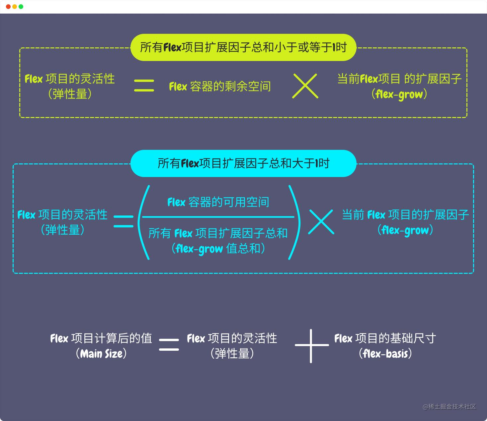

通过前面的课程学习（[05 | Flexbox 布局中的 flex 基础运用](https://juejin.cn/book/7161370789680250917/section/7161623755972673550) ），你可能已经知道了，在 Flex 项目上使用 `flex` 属性时，浏览器会根据具体的值来计算 Flex 项目，比如扩展 Flex 项目，或收缩 Flex 项目，或不变。我想大家一定很好奇它们是如何计算的。

接下来几节课，我们分别来看看 `flex-grow` 、`flex-shrink` 和 `flex-basis` 三个属性是如何对 Flex 项目产生影响的。

为了能帮助大家更好地理解 `flex-grow` 、`flex-shrink` 和 `flex-basis` 的计算，我们通过下面这个简单的示例着手：

```HTML
<div class="container">
  <!-- Flex 项目 A -->
  <div class="item"><span>A</span>longlonglongword</div> 
  <!-- Flex 项目 B -->
  <div class="item"><span>B</span>ook</div>
  <!-- Flex 项目 C -->
  <div class="item"><span>C</span>ountries in the east</div>
  <!-- Flex 项目 D -->
  <div class="item"><span>D</span>iscuss</div>
  <!-- Flex 项目 E -->
  <div class="item"><span>E</span>astern</div>
</div>
```

```CSS
.container {
  display: flex;
  inline-size: 1000px;
  font-size: 1.5rem;
}

.item span {
  font-size: 3rem;
}
```

示例中有一个 Flex 容器 `.container` ，它的宽度是 `1000px` （设置了 `inline-size`），并且这个 Flex 容器包含了 **五个 Flex 项目** ，我们分别以字母开头来对其命名，即 **A** 、**B** 、**C** 、 **D**  和 **E** 。

在代码中没有给任何 Flex 项目显式设置尺寸（`width` 、`inline-size` 或 `flex-basis` 等），所以它们的尺寸分别是由每个 Flex 项目所在内容的最大宽度（`max-content`）来决定的，不过它们会受文本相关属性值的影响，比如 `font-size` 、`font-family` （[字形的宽度或高度](https://en.wikipedia.org/wiki/Glyph)）、特定单词和文本的长度（比如长字符单词）、Flex 项目包含元素固有或指定的大小（比如示例中的`span` 元素）：

- Flex 容器可用空间是 `1000px` ；
- Flex 项目 A 的宽度约是 `237.56px`；
- Flex 项目 B 的宽度约是 `70.26px`；
- Flex 项目 C 的宽度约是 `243.30px`；
- Flex 项目 D 的宽度约是 `100.69px` ；
- Flex 项目 E 的宽度约是 `100.11px` ；
- Flex 容器的剩余空间约是 `248.08px` 。


在此基础上，所有 Flex 项目的 `flex-basis` 都是初始值，即 `auto` ，`width` （或 `inline-size`）也是初始值 `auto` 。

> 注意，接下来的示例都以 `flex-direction` 为 `row` 展开，即只围绕着 Flex 项目的宽度计算为例！

## flex-grow 的计算

先来看 `flex-grow` 的计算。

首先，我们在所有 Flex 项目上显式设置 `flex` 的值为 `1` ：

```CSS
.item {
    flex: 1;
}
```

通过课程前面的内容我们可以得知，`flex:1` 相当于：

```CSS
.item {
  flex-grow: 1;
  flex-shrink: 1;
  flex-basis: 0%;
}
```

由于所有 Flex 项目的内容宽度总和（`751.92px`）小于 Flex 容器宽度（`1000px`）。结果，浏览器使用 `flex-grow` 的值作为 Flex 项目的扩展因子，每个 Flex 项目按扩展因子的比率瓜分了 Flex 容器的剩余空间（`248.08px`）。 此示例中的每个 Flex 项目都有一个 `flex-grow` 值为 `1` 和一个 `flex-basis` 值为 `0` 。

在此基础上，浏览器会按下面这个公式循环遍历每一个 Flex 项目以确定其灵活性（**flexibility** ）：


> **注意，这里所说的灵活性（Flexibility）指运用于 Flex 项目的一个弹性值，有可能是加上这个弹性值，也有可能是减去这个弹性值。即可增加或减少的一个弹性量** 。

这个“Flex 项目的灵活性（弹性量）” 并不是 Flex 项目的具体宽度，需要在该计算出来的值基础上，加上 Flex 项目的 `flex-basis` （或 `width` 或 `inline-size`）才是 Flex 项目的最终宽度值：


浏览器会根据该公式循环遍历计算 Flex 项目的灵活性（弹性量）。先根据公式来计算 **Flex 项目** ***A***  的灵活性。

```CSS
Flex 项目 A的灵活性 = (Flex 容器的剩余空间  ÷ 所有 Flex 项目扩展因子 flex-grow 值总和 × 当前 Flex 项目自身的扩展因子 flex-grow

Flex 项目 A 的灵活性 = （1000px ÷ 5) × 1 = 200px
```

> **需要注意的是，当 Flex 项目未显式设置** **`flex-basis`** **、** **`width`** **或** **`inline-size`**  **属性值时，浏览器将以 Flex 项目的内容长度（****`max-content`****）视为 Flex 项目的基础尺寸，但 Flex 容器的剩余空间等于 Flex 容器的可用空间** 。

Flex 项目 A 具有 `200px` 的灵活性（弹性量）。接下来，将此灵活性值添加到 Flex 项目 A 的 `flex-basis` 值上，它的值是 `0` ，即：

```CSS
Flex 项目 A 计算后的宽度（flex-basis） = 0 + 200px = 200px
```

按理说，根据计算 Flex 项目 A 的 `flex-basis` 值应该是 `200px` ，即它的宽度是 `200px` ，但由于其内容是一个长单词（"Alonglonglongword"），该词的最大内容长度大约是 `237.56px` 。浏览器没有将 Flex 项目 A 的大小设置为 `200px` ，而是将其宽度限制为 `237.56px` 的最小内容大小。

只有计算完 Flex 项目 A 之后，浏览器才会开始来计算 Flex 项目 B。减去 Flex 项目 A 计算出来的宽度值之后，Flex 容器的可用空间大约还有 `762.44px` ，分布在 Flex 项目 B、C、D 和 E 中。

按计算 Flex 项目 A 的方式来计算 Flex 项目 B 宽度：

```CSS
Flex 项目 B 的灵活性 = (Flex 容器的剩余空间  ÷ 所有 Flex 项目扩展因子 flex-grow 值总和) × 当前 Flex 项目自身的扩展因子 flex-grow

Flex 项目 B 的灵活性 = （762.44px ÷ 4) × 1 = 190.61px

Flex 项目 B 计算后的宽度（flex-basis） = 0 + 190.61px = 190.61px
```

按同样的方式，可以计算出 Flex 项目 C 、 Flex 项目 D 和 Flex 项目 E 的宽度：

```CSS
Flex 项目 C 计算后的宽度 = ((1000px - 237.56px - 190.61px) ÷ 3 ) × 1 + 0 = 190.61px

Flex 项目 D 计算后的宽度 = ((1000px - 237.56px - 190.61px - 190.61px) ÷ 2 ) × 1 + 0 = 190.61px

Flex 项目 E 计算后的宽度 =  ((1000px - 237.56px - 190.61px - 190.61px - 190.61px) ÷ 1 ) × 1 + 0 = 190.61px
```


如果你使用的是 Firefox 浏览器，使用开发者调试工具，可以很清楚看到每个 Flex 项目的计算前后的几个重要参数，比如内容宽度 `flex-basis` （未显式设置都是 `0`）、每个 Flex 项目的弹性量（**Flexibility**）和每个 Flex 项目计算后的宽度：


你可能认为，你已经知道 Flex 项目如何根据 `flex-grow` 来扩展 Flex 项目的尺寸（`width` 或 `inline-size`）了。如果你这么认为，那就太小看 Flex 项目计算了。上面仅仅是其中一种情况，即 `flex-grow:1` 和 `flex-basis: 0%` 且未在 Flex 项目上显式设置任何与尺寸有关的属性（比如 `width` 或 `inline-size` ）。

如果我们把前面示例中的 `flex:1` 更换成 `flex: 1 160px` ：

```CSS
.item {
    flex: 1 160px;
    
    /* 等同于 */
    flex-grow: 1;
    flex-shrink: 1;
    flex-basis: 160px;
}
```

尝试着按照前面的计算公式来进行计算，需要注意的是，前面示例中我们未显式设置 `flex-basis` 的值，浏览器会视其为 `0%` ，此时浏览器将 Flex 容器的剩余空间计算为 `1000px` 。但我们这个示例中，显式设置了 `flex-basis` 的值为 `160px` ，那么对应的 Flex 容器的剩余空间就是 `200px` （即 `(1000px - 160px × 5) = 200px` )。

同样先计算 Flex 项目 A :

```CSS
Flex 项目 A 的灵活性 = (Flex 容器的剩余空间  ÷ 所有 Flex 项目扩展因子 flex-grow 值总和 × 当前 Flex 项目自身的扩展因子 flex-grow

Flex 项目 A 的灵活性 = （200px ÷ 5) × 1 = 40px

Flex 项目 A 计算后的宽度（flex-basis） = 160px + 40px = 200px
```

同样的，因为 Flex 项目 A 的内容是一个长单词，它最终会以其内容的最小尺寸为准（即 `min-content`），大约是 `237.56px` 。接着浏览器将按同样的方式循环遍历每个 Flex 项目：

```CSS
Flex 项目 B 计算后的宽度 = ((1000px - 237.56px) - 160px × 4) ÷ 4 × 1 + 160px = 190.61px

Flex 项目 C 计算后的宽度 = ((1000px - 237.56px - 190.61px) - 160px × 3) ÷ 3 × 1 + 160px = 190.61px

Flex 项目 D 计算后的宽度 =  ((1000px - 237.56px - 190.61px - 190.61px) - 160px × 2) ÷ 2 × 1 + 160px = 190.61px

Flex 项目 E 计算后的宽度 =  ((1000px - 237.56px - 190.61px - 190.61px - 190.61px) - 160px × 1) ÷ 1 × 1 + 160px = 190.61px
```


> Demo 地址：https://codepen.io/airen/full/NWMjvym

接着再来看另一个情景，给所有 Flex 项目显式设置 `flex:1` ，并且显式设置 `width` 或 `inline-size` 属性的值为 `160px` ：

```CSS
.item {
    flex: 1;
    width: 160px;
    
    /* flex 等同于 */
    flex-grow: 1;
    flex-shrink: 1;
    flex-basis: 0%;
}
```

通过前面的内容，我们可以知道，浏览器计算出来的 Flex 项目的 `flex-basis` 值将会是：

```CSS
Flex 项目 A 的灵活性 = (Flex 容器的剩余空间  ÷ 所有 Flex 项目扩展因子 flex-grow 值总和 × 当前 Flex 项目自身的扩展因子 flex-grow

Flex 项目 A 的灵活性 = （1000px ÷ 5) × 1 = 200px

Flex 项目 A 计算后的宽度（flex-basis） = 0 + 200px = 200px

Flex 项目 B 计算后的宽度（flex-basis） = ((1000px - 200px）÷ 4) × 1 = 200px
Flex 项目 C 计算后的宽度（flex-basis） = ((1000px - 200px - 200px）÷ 3) × 1 = 200px
Flex 项目 D 计算后的宽度（flex-basis） = ((1000px - 200px - 200px - 200px）÷ 2) × 1 = 200px
Flex 项目 E 计算后的宽度（flex-basis） = ((1000px - 200px - 200px - 200px -200px）÷ 1) × 1 = 200px
```

这个示例中和前面只在 Flex 项目上显式设置 `flex:1` 有一点不同之处，那就是显式设置了 Flex 项目的宽度是 `160px` ，所以 Flex 项目 A 的 `flex-basis` 计算出来之后等于 `200px` ，它比 `160px` 大，这个时候浏览器将 `flex-basis` 计算后的值视为其宽度值。


> Demo 地址： https://codepen.io/airen/full/WNJjZao

如果你将 `width:160px` 换成 `width: 260px` （它已经大于 Flex 项目 A 的 `min-content` 值）。你会发现，Flex 项目 A 的 `flex-basis` 计算出来之后是 `200px` ，但浏览器最终计算出来的 Flex 项目 A 宽度，最终以 Flex 项目 A 的内容的最小尺寸（`min-content` ）为准，大约 `237.52px` 。


这两个示例告诉我们，当 Flex 项目显式设置了 `flex:1` 和具体的 `width` 值时，如果浏览器计算出来的 `flex-basis` 大于 Flex 项目的最小内容尺寸（`min-content`） 时，将以 `flex-basis` 计算出来的值作为 Flex 项目的宽度；反之，如果计算出来的 `flex-basis` 小于 Flex 项目的最小内容尺寸（`min-content`）时，浏览器会把 Flex 项目的最小内容尺寸（`min-content`）作为 `flex-basis` 的最终值，也将其作为该 Flex 项目的宽度。

你可以尝试着将 `flex: 1 160px` 和 `width: 160px` ，或 `flex: 1 160px` 和 `width: 260px` 运用到示例中的 Flex 项目上：

```CSS
.item {
    flex: 1 160px;
    width: 160px;
    
    /* flex 属性等同于 */
    flex-grow: 1;
    flex-shrink: 1;
    flex-basis: 160px;
}

/* 或 */
.item {
    flex: 1 160px;
    width: 260px;
    
    /* flex 属性等同于 */
    flex-grow: 1;
    flex-shrink: 1;
    flex-basis: 160px;
}
```

最终它的效果和在 Flex 项目上设置 `flex:1` 和 `width: 160px` 是等同的，只是计算出来的弹性量不同，但最终计算出来的 `flex-basis` 是一样的，它们都忽略了 Flex 项目的 `width` 。


> Demo 地址： https://codepen.io/airen/full/XWqRVZd

这几个示例从侧面也回答了刚才提到的一点，为什么 `flex:1` 并不能在所有的场景中，让 Flex 项目均分 Flex 容器的空间。就这一点而言，[W3C规范也是有相应描述的](https://www.w3.org/TR/css-flexbox-1/)：

> By default, flex items won’t shrink below their minimum content size (the length of the longest word or fixed-size element). To change this, set the min-width or min-height property.

大致的意思就是说，**默认情况之下，Flex 项目（即设置了** **`flex:1`** **）在收缩的时候，其宽度也不会小于其最小内容尺寸（****`min-content`****）或固定尺寸元素。如果要改变这一点，需要在 Flex 项目上显示设置最小宽度** **`min-width`** **(或** **`min-inline-size`****)****，****或最小高度****`min-height`****（或****`min-block-size`****）的值，一般将其设置为****`0`** 。

你可能已经发现了，前面的示例有一个共同的特性，那就是 `flex-basis` 的值为 `0` ，或者一个指定的长度值（`<length-perentage>`）。比如：

```CSS
.item {
    flex: 1;
    
    /* 等同于 */
    flex-grow: 1;
    flex-shrink: 1;
    flex-basis: 0%; /* 浏览器将 flex-basis 计算为 0% */
}

.item {
    flex: 1 160px;
    
    /* 等同于 */
    flex-grow: 1;
    flex-shrink: 1;
    flex-basis: 160px; /* 显式指定 flex-basis 的值为 160px */
}
```

那么当 `flex-basis` 的值为 `auto` 的时候，Flex 项目又是如何计算的呢？

如果你在 Flex 项目显式设置了 `flex: auto` 时，相当于显式指定了 `flex-basis` 属性的值为 `auto` ，即： 

```CSS
.item {
    flex: auto; /* 等同于 flex: 1 auto */
    
    /* 等同于 */
    flex-grow: 1;
    flex-shrink: 1;
    flex-basis: auto;
}
```

当 `flex-basis` 取值为 `auto` 时，它的表现形式有点类似于元素的 `width` 或 `inline-size` 显式设置了值为 `auto` ，它的大小会根据元素的上下文或内容最大长度来决定。

但在 Flexbox 布局中，Flex 项目的 `flex-basis` 值为 `auto` 时，它的大小由 Flex 项目的最大内容长度（即 `max-content`）来决定。这个时候，示例中的每个 Flex 项目对应的 `flex-basis` 相当于 `237.56px` 、`70.26px` 、`243.30px` 、`100.69px` 和 `100.11px` 。

将相应的变量套到 `flex-grow` 计算公式中：

```CSS
Flex 项目 A 的灵活性 = (Flex 容器的剩余空间  ÷ 所有 Flex 项目扩展因子 flex-grow 值总和 × 当前 Flex 项目自身的扩展因子 flex-grow

Flex 项目 A 的灵活性 = (1000px - 237.52px - 70.26px - 243.30px - 100.69px - 100.11px) ÷ 5 × 1 = 49.62px

Flex 项目 A 计算后的宽度（flex-basis） = 237.56px + 49.62px = 287.18px

Flex 项目 B 计算后的宽度（flex-basis） = (1000px - 287.18px - 70.26px - 243.30px - 100.69px - 100.11px) ÷ 4 × 1 + 70.26px = 119.88px
Flex 项目 C 计算后的宽度（flex-basis） = (1000px - 287.18px - 119.88px - 243.30px - 100.69px - 100.11px) ÷ 3 × 1 + 243.30px = 292.92px
Flex 项目 D 计算后的宽度（flex-basis） = (1000px - 287.18px - 119.88px - 292.92px - 100.69px - 100.11px) ÷ 2 × 1 + 100.69px = 150.31px
Flex 项目 E 计算后的宽度（flex-basis） = (1000px - 287.18px - 119.88px - 292.92px - 150.31px - 100.11px) ÷ 1 × 1 + 100.11px = 149.73px
```


> Demo 地址： https://codepen.io/airen/full/XWqREWP

但当 `flex-basis: auto` 碰到 Flex 项目显式设置了长度尺寸，比如 `width` 或 `inline-size` 时，此时的 `auto` 计算出来的值就是对应的 `width` 或 `inline-size` 的值：

```CSS
.item {
    flex: auto;
    width: 160px;
    
    /* 等同于 */
    flex-grow: 1;
    flex-shrink: 1;
    flex-basis: auto; /* 每个 Flex 项目的 flex-basis 初始值等于 width */
}
```

计算之后：

```CSS
Flex 项目 A 的灵活性 = (Flex 容器的剩余空间  ÷ 所有 Flex 项目扩展因子 flex-grow 值总和 × 当前 Flex 项目自身的扩展因子 flex-grow

Flex 项目 A 的灵活性 = (1000px - 160px × 5) ÷ 5 × 1 = 40px

Flex 项目 A 计算后的宽度（flex-basis） = 160px + 40px = 200px

Flex 项目 B 计算后的宽度（flex-basis） = (1000px - 200px - 160px × 4) ÷ 4 × 1 + 160px = 200px
Flex 项目 C 计算后的宽度（flex-basis） = (1000px - 200px - 200px - 160px × 3) ÷ 3 × 1 + 160px = 200px
Flex 项目 D 计算后的宽度（flex-basis） = (1000px - 200px - 200px - 200px - 160px × 2) ÷ 2 × 1 + 160px = 200px
Flex 项目 E 计算后的宽度（flex-basis） = (1000px - 200px - 200px - 200px - 200px - 160px × 1) ÷ 1 × 1 + 160px = 200px
```


> Demo 地址： https://codepen.io/airen/full/poVPLQx

其实 `flex-grow` 计算，还可以将上面的公式简化一下，但它有一个条件，即 **设置了** **`flex`** **属性的 Flex 项目同时显式设置了** **`width`** **或** **`inline-size`** **，以及** **`flex-basis`** **属性值为** **`auto`** **时，** 可以按下面这个简化公式计算每个 Flex 项目的尺寸：


前面所提到的 `flex-grow` 计算，都是基于`flex` 简写属性展开的，它们的计算和单独只在 Flex 项目上显式设置一个 `flex-grow` 属性还是有所不同的。比如：

```CSS
.flex {
    flex: 1;
    
    /* 等同于 */
    flex-grow: 1;
    flex-shrink: 1;
    flex-basis:  0%; /* 浏览器计算值 */
}

.flex-grow {
    flex-grow: 1;
    
    /* 等同于 */
    flex-grow: 1;
    flex-shrink: 1; /* flex-shrink 的初始值为 1 */
    flex-basis: auto; /* flex-basis 的初始值为 auto */
}
```

**仅在 Flex 项目显式设置** **`flex-grow`** **一个属性时，它的计算方式类似于** **`flex: auto`** ：


> Demo 地址： https://codepen.io/airen/full/ZEoKoJY

除此之外，可以根据需要给每个 Flex 项目的 `flex-grow` 属性设置不同的值。比如：

```CSS
.item {
    flex-grow: var(--flex-grow, 0);
}

.item:nth-child(1) {
    --flex-grow: 0;
}

.item:nth-child(2) {
    --flex-grow: 1;
}

.item:nth-child(3) {
    --flex-grow: 2;
}

.item:nth-child(4) {
    --flex-grow: 3;
}

.item:nth-child(5) {
    --flex-grow: 4;
}
```

Flex 项目的 `flex-grow` 设置不同的值时，表示每个 Flex 项目的扩展比率是不相同的，也就是说瓜分 Flex 容器剩余空间就不相等了。**`flex-grow`** **值越大，所占的比例就越大** 。我们分别来看，`flex-grow` 取值不同时，它的计算：

```CSS
Flex 项目的 flex-grow 总和 =  (0 + 1 + 2 + 3 + 4) = 10
Flex 项目的灵活性 = (Flex 容器的剩余空间  ÷ 所有 Flex 项目扩展因子 flex-grow 值总和 × 当前 Flex 项目自身的扩展因子 flex-grow

// 案例1
// Flex 项目的 flex-basis: auto; 

Flex 项目 A 的弹性值 = (1000px - 237.52px - 70.26px - 243.30px - 100.69px - 100.11px) ÷ (0 + 1 + 2 + 3 + 4) × 0 = 0px
Flex 项目 A 计算后的 flex-basis 值 = 237.52px + 0 = 237.52px

Flex 项目 B 的弹性值 = (1000px - 237.52px - 70.26px - 243.30px - 100.69px - 100.11px) ÷ (1 + 2 + 3 + 4) × 1 = 24.81px
Flex 项目 B 计算后的 flex-basis 值 = 70.26px + 24.81px = 95.07px

Flex 项目 C 的弹性值 = (1000px - 237.52px - 95.07px - 243.30px - 100.69px - 100.11px) ÷ (2 + 3 + 4) × 2  = 49.62px
Flex 项目 C 计算后的 flex-basis 值 = 243.30px + 49.62px = 292.92px

Flex 项目 D 的弹性值 = (1000px - 237.52px - 95.07px - 292.92px - 100.69px - 100.11px) ÷ (3 + 4) × 3 = 74.44px
Flex 项目 D 计算后的 flex-basis 值 = 100.69px + 74.44px = 175.13px

Flex 项目 E 的弹性值 = (1000px - 237.52px - 95.07px - 292.92px - 175.13px - 100.11px) ÷ 4 × 4  = 99.25px
Flex 项目 E 计算后的 flex-basis 值 = 100.11px + 99.25px = 199.36px

// 案例2
// Flex 项目的 flex-basis: auto; width: 160px

Flex 项目 A 的弹性值 = (1000px - 160px × 5) ÷ (0 + 1 + 2 + 3 + 4) × 0 = 0px
Flex 项目 A 计算后的 flex-basis 值 = 160px + 0 = 160px

Flex 项目 B 的弹性值 = (1000px - 160px - 160px × 4) ÷ (1 + 2 + 3 + 4) × 1 = 20px
Flex 项目 B 计算后的 flex-basis 值 = 160px + 20px = 180px

Flex 项目 C 的弹性值 = (1000px - 160px - 180px - 160px × 3) ÷ (2 + 3 + 4) × 2 = 40px
Flex 项目 C 计算后的 flex-basis 值 = 160px + 40px = 200px

Flex 项目 D 的弹性值 = (1000px - 160px - 180px - 200px - 160px × 2) ÷ (3 + 4) × 3 = 60px
Flex 项目 D 计算后的 flex-basis 值 = 160px + 60px = 220px

Flex 项目 E 的弹性值 = (1000px - 160px - 180px - 200px - 220px - 160px) ÷ 4 × 4 = 80px
Flex 项目 E 计算后的 flex-basis 值 = 160px + 80px = 240px

// 案例1和2对应的 Demo 地址： https://codepen.io/airen/full/GRdmdbw


// 案例3
// Flex 项目的 flex-basis: 0;

Flex 项目 A 的弹性值 = 1000 ÷ (0 + 1 + 2 + 3 + 4) × 0 = 0px
Flex 项目 A 计算后的 flex-basis 值 = 237.5px + 0 = 237.5px (Flex 项目 A 的 min-content)

Flex 项目 B 的弹性值 = (1000px - 237.5px) ÷ (1 + 2 + 3 + 4) × 1  = 76.25px
Flex 项目 B 计算后的 flex-basis 值 = 70.25px + 0 = 70.25px

Flex 项目 C 的弹性值 = (1000px - 237.5px - 76.25px) ÷ (2 + 3 + 4) × 2  = 152.5px
Flex 项目 C 计算后的 flex-basis 值 = 152.5px + 0 = 152.5px

Flex 项目 D 的弹性值 = (1000px - 237.5px - 76.25px - 152.5px) ÷ (3 + 4) × 3 = 228.75px
Flex 项目 D 计算后的 flex-basis 值 = 228.75px + 0 = 228.75px

Flex 项目 E 的弹性值 = (1000px - 237.5px - 76.25px - 152.5px - 228.75px) ÷ 4 × 4  = 305px
Flex 项目 E 计算后的 flex-basis 值 =  305px + 0 = 305px

// 案例4
// Flex 项目的 flex-basis: 0; width: 160px

Flex 项目 A 的弹性值 = 1000px ÷ (0 + 1 + 2 + 3 + 4) × 0 =0px
Flex 项目 A 计算后的 flex-basis 值 = 160px + 0 = 160px (Flex项目 A 不扩展，取其 width 值)

Flex 项目 B 的弹性值 = (1000px - 160px) ÷ (1 + 2 + 3 + 4) × 1  = 84px  
Flex 项目 B 计算后的 flex-basis 值 = 84px + 0 = 84px

Flex 项目 C 的弹性值 = (1000px - 160px - 84px) ÷ (2 + 3 + 4) × 2 = 168px
Flex 项目 C 计算后的 flex-basis 值 = 168px + 0 = 168px

Flex 项目 D 的弹性值 = (1000px - 160px - 84px - 168px) ÷ (3 + 4) × 3  = 252px
Flex 项目 D 计算后的 flex-basis 值 = 252px + 0 = 252px

Flex 项目 E 的弹性值 = (1000px - 160px - 84px - 168px - 252px) ÷ 4 × 4  = 336px
Flex 项目 E 计算后的 flex-basis 值 = 336px + 0 = 336px

// 案例3 和 4 对应的 Demo 地址：https://codepen.io/airen/full/bGMRpZp 


// 案例5
// 所有 Flex 项目的 flex-basis: 160px

Flex 项目 A 的弹性值 = (1000px - 160px × 5) ÷ (0 + 1 + 2 + 3 + 4) × 0 = 0px
Flex 项目 A 计算后的 flex-basis = 237.5px + 0 = 237.5px （不扩展，取其内容最小尺寸 min-content）

Flex 项目 B 的弹性值 = (1000px - 237.5px - 160px × 4) ÷ (1 + 2 + 3 + 4) × 1 = 12.25px
Flex 项目 B 计算后的 flex-basis 值 = 160px + 12.25px = 172.25px

Flex 项目 C 的弹性值 = (1000px - 237.5px - 172.25px - 160px × 3) ÷ (2 + 3 + 4) × 2 = 24.5px
Flex 项目 C 计算后的 flex-basis 值 = 160px + 24.5px = 184.5px

Flex 项目 D 的弹性值 = (1000px - 237.5px - 172.25px - 184.5px - 160 × 2) ÷ (3 + 4) × 3 = 36.75px
Flex 项目 D 计算后的 flex-basis 值 = 160px + 36.75px = 196.75px

Flex 项目 E 的弹性值 = (1000px - 237.5px - 172.25px - 184.5px - 196.75px - 160px) ÷ 4 × 4 = 49px 
Flex 项目 E 计算后的 flex-basis 值 = 160px + 49px = 209px

// 案例6
// 所有 Flex 项目的 flex-basis: 160px; width: 160px
Flex 项目 A 的弹性值 = (1000px - 160px × 5) ÷ (0 + 1 + 2 + 3 + 4) × 0 = 0px
Flex 项目 A 计算后的 flex-basis = 160px + 0 = 160px （不扩展，取其 width 属性值）

Flex 项目 B 的弹性值 = (1000px - 160px - 160px × 4) ÷ (1 + 2 + 3 + 4) × 1 = 20px
Flex 项目 B 计算后的 flex-basis 值 = 160px + 20px = 180px

Flex 项目 C 的弹性值 = (1000px - 160px - 180px - 160px × 3) ÷ (2 + 3 + 4) × 2 = 40px
Flex 项目 C 计算后的 flex-basis 值 = 160px + 40px = 200px

Flex 项目 D 的弹性值 = (1000px - 160px - 180px - 200px - 160px × 2) ÷ (3 + 4) × 3 = 60px
Flex 项目 D 计算后的 flex-basis 值 = 160px + 60px = 220px

Flex 项目 E 的弹性值 = (1000px - 160px - 180px - 200px - 220px - 160px) ÷ 4 × 4 = 80px
Flex 项目 E 计算后的 flex-basis 值 = 160px + 80px = 240px

// 案例 5 和 6 的 Demo 地址： https://codepen.io/airen/full/GRdEqqp
```

在给 Flex 项目设置 `flex-grow` 属性的值时，除了像前面的示例展示的那样，设置一个**正整数** 之外，还可以**给** **`flex-grow`** **设置一个小数值** ，比如：

```CSS
// Demo 1:
.item {
    flex-grow: .1;
    
    /* 等同于 */
    flex-grow: .1;
    flex-shrink: 1;
    flex-basis: auto;
}

// Demo 2:
.item {
    flex-grow: var(--flex-grow, .1);
}

.item:nth-child(2) {
    --flex-grow: .2;
}

.item:nth-child(3) {
    --flex-grow: .3;
}

.item:nth-child(4) {
    --flex-grow: .4;
}

.item:nth-child(5) {
    --flex-grow: .5;
}
```

上面两个示例中，第一个示例中的所有 Flex 项目的 `flex-grow` 属性的值和是 `0.5`（即 `0.1 + 0.1 + 0.1 + 0.1 + 0.1 = 0.5` ），**它们（`flex-grow`** **）的总和小于** **`1`** ；第二个示例中的所有 Flex 项目的 `flex-grow` 属性的值和是 `1.5` （即 `0.1 + 0.2 + 0.3 + 0.4 + 0.5 = 1.5`），**它们（****`flex-grow`****）的总和大于** **`1`** 。

两者最大的差异就是 **所有 Flex 项目的** **`flex-grow`** **总和如果小于** **`1`** **，Flex 容器剩余空间还会有余留； `flex-grow`** **大于或等于**`1`**时，Flex 容器的剩余空间不会有余留** ：


可能有同学会问，`flex-grow` 取值为小数值时，它又是如何计算呢？

它的计算分两种情况，当所有 Flex 项目 `flex-grow` 值的和小于 `1` 时，将按照下面的公式来计算：


由于 Flex 容器的剩余空间分不完，所以不需要像前面的示例那样去循环遍历每一个 Flex 项目。简单地说，**当所有 Flex 项目的** **`flex-grow`** **属性值的总和小于等于** **`1`** **时， Flex 项目的灵活性（弹性值 Flexibility）会等于  Flex 容器的剩余空间乘以当前 Flex 项目自身的扩展因子** **`flex-grow`** **值**：

```CSS
Flex 项目的 flex-grow 总和 =  (0.1 + 0.1 + 0.1 + 0.1 + 0.1) = 0.5 < 1
Flex 项目的灵活性 = (Flex 容器的剩余空间  × 当前 Flex 项目自身的扩展因子 flex-grow
Flex 容器的剩余空间 = 1000px - 237.52px - 70.26px - 243.30px - 100.69px - 100.11px = 248.12px

Flex 项目 A 的弹性值 = 248.12px × 0.1 = 24.81px
Flex 项目 A 计算后的 flex-basis 值 = 237.52px + 24.81px = 262.33px

Flex 项目 B 的弹性值 = 248.12px × 0.1 = 24.81px
Flex 项目 B 计算后的 flex-basis 值 = 70.26px + 24.81px = 95.07px

Flex 项目 C 的弹性值 = 248.12px × 0.1 = 24.81px
Flex 项目 C 计算后的 flex-basis 值 = 243.30px + 24.81px = 268.11px 

Flex 项目 D 的弹性值 = 248.12px × 0.1 = 24.81px
Flex 项目 D 计算后的 flex-basis 值 = 100.69px + 24.81px = 125.5px

Flex 项目 E 的弹性值 =  248.12px × 0.1 = 24.81px
Flex 项目 E 计算后的 flex-basis 值 = 100.11px + 24.81px = 124.92px
```


> Demo 地址： https://codepen.io/airen/full/eYrRdLN

将上面示例稍微调整一下，让它们的 `flex-grow` 值的总和等于`1` ：

```CSS
.item {
    flex-grow: var(--flex-grow, 0);
}

.item:nth-child(2) {
    --flex-grow: .2;
}

.item:nth-child(3) {
    --flex-grow: .2;
}

.item:nth-child(4) {
    --flex-grow: .3;
}

.item:nth-child(5) {
    --flex-grow: .3;
}
```

它的计算和所有 Flex 项目的 `flex-grow` 值总和小于`1` 的计算方式是一样的：

```CSS
Flex 项目的 flex-grow 总和 =  (0 + 0.2 + 0.2 + 0.3 + 0.3) = 1
Flex 项目的灵活性 = (Flex 容器的剩余空间  × 当前 Flex 项目自身的扩展因子 flex-grow
Flex 容器的剩余空间 = 1000px - 237.52px - 70.26px - 243.30px - 100.69px - 100.11px = 248.12px

Flex 项目 A 的弹性值 = 248.12px × 0 = 0px
Flex 项目 A 计算后的 flex-basis 值 = 237.52px + 0px = 237.52px

Flex 项目 B 的弹性值 = 248.12px × 0.2 = 49.62px
Flex 项目 B 计算后的 flex-basis 值 = 70.26px + 49.62px = 119.88px

Flex 项目 C 的弹性值 = 248.12px × 0.2 = 49.62px
Flex 项目 C 计算后的 flex-basis 值 = 243.30px + 49.62px = 292.92px 

Flex 项目 D 的弹性值 = 248.12px × 0.3 = 74.44px
Flex 项目 D 计算后的 flex-basis 值 = 100.69px + 74.44px = 175.13px

Flex 项目 E 的弹性值 =  248.12px × 0.3 = 74.44px
Flex 项目 E 计算后的 flex-basis 值 = 100.11px + 74.44px = 174.55px
```


> Demo 地址： https://codepen.io/airen/full/oNdwBWK

当然，`flex-grow` 取值小于 `1` 时，它们的总和也有可能会是大于`1` 的，比如：

```CSS
.item {
    flex-grow: var(--flex-grow, .1);
}

.item:nth-child(2) {
    --flex-grow: .2;
}

.item:nth-child(3) {
    --flex-grow: .3;
}

.item:nth-child(4) {
    --flex-grow: .4;
}

.item:nth-child(5) {
    --flex-grow: .5;
}
```

当所有 Flex 项目的 `flex-grow` 属性值总和大于 `1` 时，对于 `flex-grow` 的计算就需要用到前面所说的循环遍历的方式来计算了：

```CSS
Flex 项目的 flex-grow 总和 =  (0.1 + 0.2 + 0.3 + 0.4 + 0.5) = 1.5 > 1
Flex 项目的灵活性 = (Flex 容器的剩余空间  ÷ 所有 Flex 项目扩展因子 flex-grow 值总和 × 当前 Flex 项目自身的扩展因子 flex-grow

Flex 容器的剩余空间 = 1000px - 237.52px - 70.26px - 243.30px - 100.69px - 100.11px = 248.12px

Flex 项目 A 的弹性值 = (1000px - 237.52px - 70.26px - 243.30px - 100.69px - 100.11px) ÷ (0.1 + 0.2 + 0.3 + 0.4 + 0.5) × 0.1 = 16.54px
Flex 项目 A 计算后的 flex-basis 值 = 237.52px + 16.54px = 254.06px

Flex 项目 B 的弹性值 = (1000px - 254.06px - 70.26px - 243.30px - 100.69px - 100.11px) ÷ (0.2 + 0.3 + 0.4 + 0.5) × 0.2 = 33.08px
Flex 项目 B 计算后的 flex-basis 值 = 70.26px + 33.08px = 103.34px

Flex 项目 C 的弹性值 = (1000px - 254.06px - 103.34px - 243.30px - 100.69px - 100.11px) ÷ (0.3 + 0.4 + 0.5) × 0.3 = 49.63px
Flex 项目 C 计算后的 flex-basis 值 = 243.30px + 49.63px = 292.93px 

Flex 项目 D 的弹性值 = (1000px - 254.06px - 103.34px - 292.93px - 100.69px - 100.11px) ÷ (0.4 + 0.5) × 0.4 = 66.16px
Flex 项目 D 计算后的 flex-basis 值 = 100.69px + 66.16px = 166.85px

Flex 项目 E 的弹性值 =  (1000px - 254.06px - 103.34px - 292.93px - 166.85px - 100.11px) ÷  0.5  × 0.5 = 82.71px
Flex 项目 E 计算后的 flex-basis 值 = 100.11px + 82.71px = 182.82px
```


> Demo 地址： https://codepen.io/airen/full/NWMgdza

如此一来，Flexbox 布局中的 `flex-grow` 计算公式就分为两个部分：




再次强调一下，**当所有 Flex 项目的** **`flex-grow`** **属性值总和小于** **`1`** **时，Flex 容器剩余空间是分不完的** :


## 小结 

有关于 Flex 项目中 `flex-grow` 计算，暂时就和大家聊到这里了。这里简单总结一下：

- 只有 Flex 容器有剩余空间，且 `flex-grow` 值不为 `0` 时，Flex 项目才会按照扩展因子（`flex-grow` 值）比率来分割 Flex 容器的剩余空间。
- 如果 Flex 容器中所有 Flex 项目的 `flex-grow` 值的总和小于 `1` 时，Flex 容器的剩余空间是分不完的（有留存），只有 `flex-grow` 值的总和大于或等于 `1` 时，Flex 容器的剩余空间才能全部分完。
- Flex 容器中的所有 Flex 项目的 `flex-grow` 值设置为 `1` ，并不能平均分配 Flex 容器的剩余空间，它和 Flex 项目自身的内容最小尺寸以及它的内部固定尺寸的元素有关。
- Flex 项目的 `flex-grow` 会给 Flex 项目的 `flex-basis` 值带来变化，但它也会受 `min-*` （比如 `min-width` 、 `min-inline-size` 、`min-height` 、`min-block-size`）和 `max-*` （比如 `max-width` 、`max-inline-size` 、`max-height` 和 `max-block-size` ）等属性的影响。

在这一节中，我们一起探讨了如何通过扩展因子比例 `flex-grow` 来分配 Flex 容器的剩余空间，从而扩展 Flex 项目尺寸。但在实际使用的时候，Flex 容器除了有剩余空间情景之外，也还会存在不足空间的情景。 Flex 容器存在不足空间时，我们可以通过 `flex` 的另一个特性 `flex-shrink` 收缩因子来收缩 Flex 项目，从而让 Flex 项目填满整个 Flex 容器。