`flex-basis` 是 Flexbox 布局模块中 `flex` 属性的另一个子属性，在前面的课程中我们深度剖析了浏览器是如何计算 Flex 项目尺寸的，或者说 Flexbox 是如何工作的。对于众多 Web 开发者而言，在 CSS 中都习惯于使用像 `width` 、`height` 、`min-*` 和 `max-*` 以及它们对应的 CSS 逻辑属性（比如 `inline-size` 、`block-size` 等）给元素设置尺寸大小。

在使用 Flexbox 布局模块时，同样如此，使用这些属性给 Flex 项目设置尺寸。只不过，这些属性不一定就能决定 Flex 项目的尺寸大小，它除了受 Flex 容器的空间和 Flex 项目的扩展因子（`flex-grow`），以及 Flex 项目的收缩因子（`flex-shrink`）影响之外，还受 Flex 项目的基准值（或者说假设主尺寸 Main Size）的影响，即 `flex-basis` 属性的影响。

在这节课程中，我们就一起来探讨这方面的话题，**在 Flexbox 布局中，Flex 项目的大小究竟是由谁来决定的** 。

## 容器的尺寸由谁来决定

Web 上的每一个元素都被视为一个盒子，它相当于一个容器，就好比我们生活中的器皿，通过格式化（CSS 的 `display` 属性的值）之后有着不同的形态：


不同的器皿都有着自己的大小。在 CSS 中，这些容器的大小可以是由容器的内容来决定，也可以显式地通过属性来控制。大家最为熟知的应该是 **CSS 盒模型中的属性来决定一个容器（元素）的大小** 。

只不过在指定容器大小时，你可能是 **明确地知道容器的确切尺寸** ，也有可能是**由着容器的内容来决定尺寸大小** 。简单地说，就是一个是**明确的尺寸** （Definite Size），一个是**不确定的尺寸** （Indefinite Size）。

-   **明确的尺寸** 指的是不需要执行布局就可以确定盒子的大小。也就是说，显式地给容器设置一个固定值，或内容所占区域的大小，或一个容器块的初始大小，或通过其他计算方式得到的尺寸，比如 Flexbox 布局中的“拉伸和收缩”（Stretch-fit），即 `flex-grow` 和 `flex-shrink` 。

<!---->

-   **不确定的尺寸** 指的是一个未知的尺寸。也就是说，容器的大小具备无限空间，有可能很大，也有可能很小。

通俗来说，明确的尺寸是知道元素的 `width` （或 `inline-size`）和 `height` （或 `block-size`）属性的确定值；不确定的尺寸是需要根据内容来计算的，所以要知道不确定的尺寸就需要先检查内容，也就是自动计算尺寸。

但不管是明确的尺寸还是不确定的尺寸设置，在 CSS 中都是由下面这些属性来控制：

| **物理属性**     | **逻辑属性（horizontal-tb）** | **逻辑属性（vertical-lr）** | **逻辑属性（vertical-rl）** |
| ------------ | ----------------------------- | -------------------------- | -------------------------- |
| `width`      | `inline-size`                 | `block-size`               | `block-size`               |
| `height`     | `block-size`                  | `inline-size`              | `inline-size`              |
| `min-width`  | `min-inline-size`             | `min-block-size`           | `min-block-size`           |
| `min-height` | `min-block-size`              | `min-inline-size`          | `min-inline-size`          |
| `max-width`  | `max-inline-size`             | `max-block-size`           | `max-block-size`           |
| `max-height` | `max-block-size`              | `max-inline-size`          | `max-inline-size`          |

这些属性被称为 **尺寸属性** ，它们可以接受 `<length-percentage>` 、`auto` 、`none` 、`min-content` 、`max-content` 和 `fit-content` （CSS Grid 中还有一个 `fit-content()`）等值。其中 `<length-percentage>` 分为 `<length>` （就是使用长度单位的一些值，比如 `100px` 、`100vw` 等），`<percentage>` 指的是百分比单位的值，比如 `50%` 。

一般情况下，CSS 尺寸属性的值是一个 **`<length-percentage>`** 的话，则表示这个容器有一个明确的尺寸；如果 CSS 尺寸属性的值是像 `auto` 、`min-content` 、`max-content` 和 `fit-content` 的话，则表示这个容器的尺寸是不明确的，需要根据内容来计算。

> **注意，`fit-content`和** **`fit-content(<length-percentage>)`** **所描述的不是同一个东西，它们的区别将放到 CSS Grid 相关的课程中介绍** 。

换句话说，在 CSS 中，任何一个容器都有四种自动计算尺寸大小的方式：

-   `auto` ：会根据格式化上下文自动计算容器的尺寸；

<!---->

-   `min-content` ：是在不导致溢出的情况下，容器的内容的最小尺寸；

<!---->

-   `max-content` ：容器可以容纳的最大尺寸，如果容器中包含未格式化的文本，那么它将显示为一个完整的长字符串；

<!---->

-   `fit-content` ：如果给定轴中的可用空间是确定的，则等于 `min(max-content, max(min-content, stretch-fit))` ，反之则等于 `max-content`。

> 需要注意的是， CSS 中的宽高比属性，即 `aspect-ratio` 也可以决定一个容器的尺寸。

在 Flexbox 布局中，Flex 项目同样被视为一个容器，它的大小也可以由这些属性（尺寸属性）和尺寸属性值来决定。只不过，对于 Flex 项目而言，除了这些尺寸属性之外，它还有一个 **`flex-basis`** **属性可用于控制尺寸大小** 。

## flex-basis 在 Flexbox 中的作用

`flex-basis` 属性在 Flexbox 中对 Flex 项目尺寸起着决定性的作用。简单地说，**`flex-basis`** **属性在任何空间分配发生之前，会对 Flex 项目的尺寸大小进行初始化** 。即，**在任何 Flex 容器空间（剩余空间或不足空间）分配发生之前初始化 Flex 项目尺寸** 。

> Flexbox 中 Flex 容器的空间是由 `flex-grow` 、`flex-shrink` 和 Flex 容器的对齐方式来分配的。详细请参阅前面的课程：《[04 | Flexbox 布局中的对齐方式](https://juejin.cn/book/7161370789680250917/section/7161623670622781471) 》、 《[06｜Flexbox 中的计算：通过扩展因子比例来扩展 Flex 项目](https://juejin.cn/book/7161370789680250917/section/7161623797794078750)》和《[07｜Flexbox 中的计算：通过收缩因子比例收缩 Flex 项目](https://juejin.cn/book/7161370789680250917/section/7164357320367931399)》。

`flex-basis` 属性的语法规则很简单：

```
flex-basis: content | <width>
```

该属性的默认值是 `auto` ，它可以接受 `content` 和 `<width>` 值。

-   `<width>` 值指的是 CSS 的 `width` 属性（尺寸属性），可用于 `width` 属性的值都可以用于 `flex-basis` ，比如我们熟悉的 `px` 、`%` 、`vw` 等，以及需要根据内容自动计算的属性值，比如 `min-content` 、`max-content` 和 `fit-content` 等。

<!---->

-   `content` 是指 Flex 项目的内容的自动尺寸，它通常相当于 Flex 项目最大内容大小（`max-content`）。

如果 `flex-basis` 的值设置为 `auto` ，浏览器将先检查 Flex 项目的主尺寸（Main Size）是否设置了绝对值，再计算 Flex 项目的初始值。比如说，你给 Flex 项目显式设置了 `width: 200px`，那么 `200px` 就是 Flex 项目的 `flex-basis` 值，该值也被称为是 Flex 项目的假设主尺寸，因为 Flex 项目的最终主尺寸（`flex-basis` 计算后的值）会受 Flex 容器剩余空间或不足空间的影响，除非 `flex-grow` 和 `flex-shrink` 两属性的值都显式设置为 `0` 。

如果 Flex 项目可以自动调整大小，则 `auto` 会解析为其内容的大小，此时 `min-content` 和 `max-content` 就会起作用，并且 Flex 项目的 `flex-basis` 值将会是 `max-content` 。

有一点需要注意的是，如果在 `flex-basis` 属性上设置了除 `auto` 和 `content` 之外的所有值，它和书写模式以及阅读模式是有关的，在水平书写模式（`ltr` 或 `rtl`），`flex-basis` 的解析方式与 `width` 相同。

不同的是，如果一个值对于 `width` 将解析为 `auto` ，那么该值对于 `flex-basis` 就会被解析为 `content`。例如，`flex-basis` 的值是一个百分比值，那么它会相对于 Flex 容器的主轴尺寸（Main Size）来计算；如果 Flex 容器的大小不确定时，则 `flex-basis` 使用的值会是 `content`。

## 可用于 flex-basis 属性的值

> **可用于 CSS 的尺寸属性，比如** **`width`** **的值都可用于** **`flex-basis`** **属性上。**

现在我们知道了，`flex-basis` 属性可以取 `<width>` 值来对 Flex 项目的主尺寸进行初始化，而一般情况之下，这个 `<width>` 就好比 CSS 中的 `width` 属性。为了更好地帮大家理解 `flex-basis` 取 `<width>` 中所起的作用，这里有必要花一点时间来重温 `width` 属性。

> **特别注意，这里的** **`<width>`** **是一个属性值，即** **`flex-basis`** **属性的值；而** **`width`** **却是一个 CSS 的尺寸属性，用于设置元素宽度的尺寸，它的值类型种类多样** 。

你可以给任何一个**非内联**元素显式设置一个 `width` 属性，用来指定容器的宽度。只不过不同的属性值渲染出来的结果有所差异。比如下面这样的一个示例：

```
:root {
  --width: auto;
}

.item {
  width: var(--width);
}
```

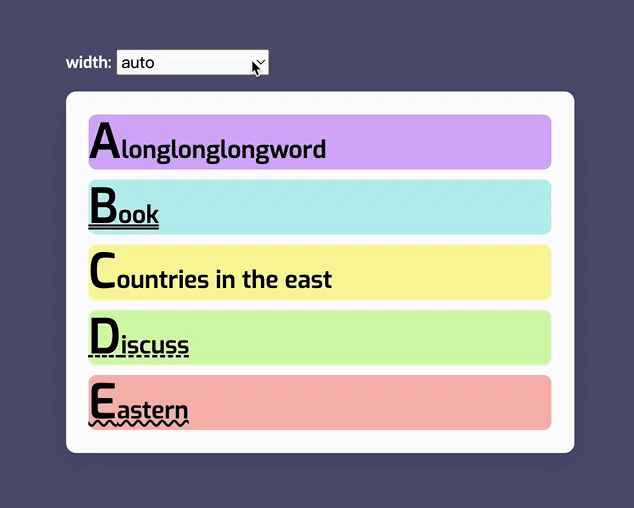

> Demo 地址： <https://codepen.io/airen/full/wvjqXrZ>

正如上图所示，当给一个容器的 `width` 属性设置一个固定值时，有一个极大的缺陷，即 **内容断行** 或 **内容溢出容器** ，尤其是内容溢出，它很有可能就会打破布局的美观。

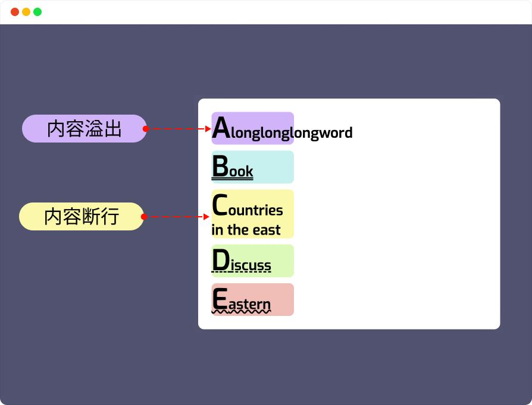

**很多时候，Web 开发者并不知道容器的内容是什么，所占的宽度是多少，就会造成上图的现象。哪怕是使用了** **`min-content`** **、`max-content`和** **`fit-content`** **也会面临类似现象** 。

为此，为了尽可能避免这种缺陷的出现，在给容器设置尺寸的时候，更建议使用 `min-width` 来替代 `width` 属性。首先能被运用于 `width` 属性的值都可以用在 `min-width` 属性上。不同的是，`min-width` 可以防止 `width` 值小于 `min-width` 指定的值所造成的布局缺陷。

> **注意，`min-width`的默认值是`auto`，浏览器计算出来的值是`0`** 。

在上面的示例中，我们知道容器 `width` 设置的值小于内容宽度的时候，会造成一定的缺陷（我们不希望看到的效果）。如果在上面的示例中，在 `.item` 上添加一个 `min-width` 就可以较好避免这种现象：

```
.item {
    width: var(--width);
    min-width: 250px;
}
```

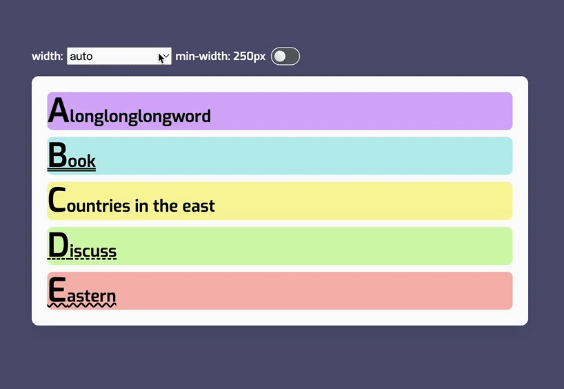

> Demo 地址： <https://codepen.io/airen/full/ZEoJjEK>

你可能会好奇，那么应该给容器的 `min-width` 属性设置一个什么样的值呢？一般情况之下，这是根据元素所在的环境来决定的。它是一个假想的理想值。

`min-width` 属性在构建 Web 布局或 Web 组件时是很有用处的，尤其是在构建一个**多语言** 的 Web 页面或 Web 应用中。在多语言版本网站中“**表达同一个意思的文本内容所占宽度是不一致的** ”，比如一个“完成”按钮，中文可能是“完成”，英文可能是“Done”，阿位伯文是“إنجاز”，韩文是“완료”，日文可能是“フィニッシュ”，蒙古语又是“Дуусга”，等等。

当你从中文切换到阿位伯文（或英文切换到阿位伯文）时，文本内容的所占宽度并不一致。如果未显式给容器设置 `width` 或 `min-width` 属性的值，就会造成按钮大小不一致，这也有可能会影响 Web 布局或整体的视觉效果。如果显式加上 `width` 就有可能会在某个语种下造成内容溢出或断行，那么这个时候显式设置一个 `min-width` 就会有一个较好的视觉效果：

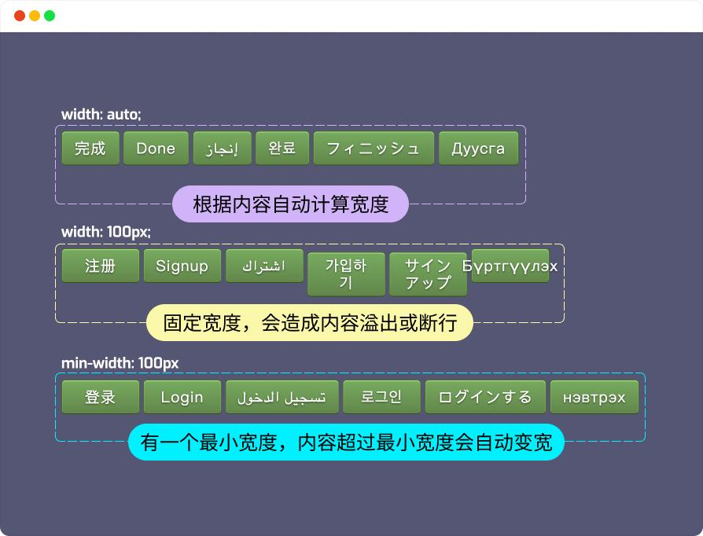

> Demo 地址： <https://codepen.io/airen/full/dyezjZL>

使用 `min-width` 的好处大家都看到了，在内容较长的按钮上，`min-width` 可以扩展容器的宽度，在内容较少的按钮上，具有统一的尺寸。

`min-width` 除了在一些多语言版本网站上可见之外，也适用于像“徽标”（Badge）这样的组件：


在构建这样的标签列表时，建议限制一个标签的最小宽度（即显式设置 `min-width` 属性的值），这样就可以保证标签列表项内容很短（少）时，它的外观不会受到影响：

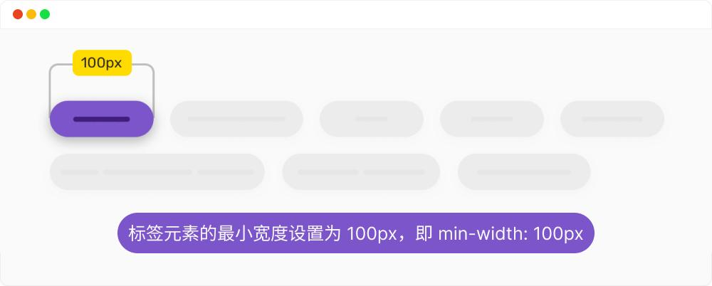

有了这种灵活性，无论标签内容有多短，标签在视觉上看起来都不错。另外，除了考虑内容过短之外，我们还需要考虑内容过长时对 UI 的视觉影响，这时候我们可以考虑使用 `max-width` 属性。

在容器（或元素）上显式设置 `max-width` 属性值时，可以防止 `width` 属性值超过了 `max-width` 指定的值，造成内容溢出。`max-width` 的一个常见而简单的用例是将它与图像一起使用。考虑下面的例子：

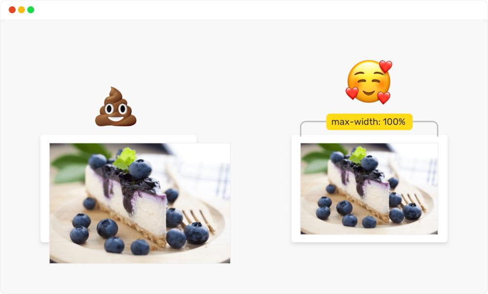

`` 比它的父容器更大。通常给 `img` 设置 `max-width` 的值为 `100%` ，图像的宽度就不会超过容器的宽度。如果图像比父容器小，则 `max-width: 100%` 不会对图像产生实际影响，因为它比容器小。

也就是说，CSS 中的 `width` 、`min-width` 和 `max-width` 都可以用来设置元素的宽度。很多时候，在实际的使用过程中，可能会在同一个元素上使用多个属性来设置容器的宽度。比如：

```
.item {
    width: 100px;
    min-width: 200px;
}

/* 或 */
.item {
    width: 200px;
    max-width: 100px;
}

/* 或 */
.item {
    min-width: 100px;
    max-width: 200px;
}

/* 或 */
.item {
    width: 150px;
    min-width: 100px;
    max-width: 200px;
}
```

那么问题来了，它们都是用来指定容器宽度的，当同一个容器上使用它们时，究竟由谁来决定容器最终的尺寸。

虽然说 `width` 、 `min-width` 和 `max-width` 三个属性都可以用来指定一个容器的宽度，但它们之间还是有一定的差异的，比如说：

```
.item {
    width: 150px;
    min-width: 100px;
    max-width: 200px;
}
```

上面这段代码将会告诉浏览器，`.item` 元素的宽度是 `150px` （由`width` 指定），但它不能小于 `100px` (由 `min-width` 指定) ，且不能大于 `200px` （由 `max-width` 指定）。不难发现，其中 `min-width` 和 `max-width` 属性像是给容器的宽度做了一定的限制。也就是说，当符合某一条件时，其中就有一个属性起作用。这个也有点类似于 CSS 选择器权重一样，看谁的权重大，谁就起作用。

为了搞清楚，它们之间权重是如何比较（谁决定谁），我们这里通过几个简单的示例来向大家阐述。先来看 `width` 和 `min-width` 两者的关系。

```
button {
    width: 100px;
}

/* width > min-width */
.case1 button:nth-child(2) {
    min-width: 80px;
}

/* width = min-width */
.case2 button:nth-child(2) {
    min-width: 100px;
}

/* width < min-width */
.case3 button:nth-child(2) {
    min-width: 140px;
}
```


> Demo 地址： <https://codepen.io/airen/full/qBYXJWq>

从这个示例中我们可以得到一个简单的结论：

> **当`width`属性的值大于或等于`min-width`属性的值时，浏览器会取`width`** **属性的值；当** **`width`** **属性的值小于** **`min-width`** **属性的值时，浏览器会取** **`min-width`** **属性的值** 。

```
if (width >= min-width) {
    浏览器取 width 属性的值
} 

if (width < min-width) {
    浏览器取 min-width 属性的值
}
```

把上面示例中的 `min-width` 换成 `max-width` ：

```
button {
    width: 100px;
}

/* width > max-width */
.case1 button:nth-child(2) {
    max-width: 80px;
}

/* width = max-width */
.case2 button:nth-child(2) {
    max-width: 100px;
}

/* width < max-width */
.case3 button:nth-child(2) {
    max-width: 140px;
}
```

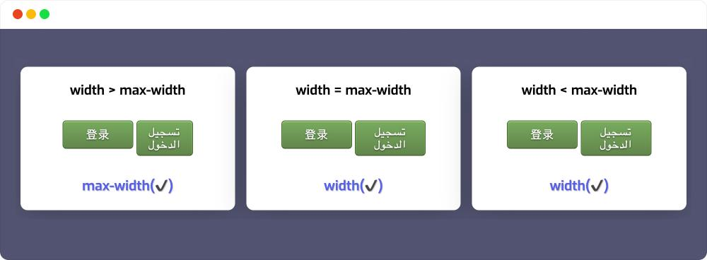

> Demo 地址： <https://codepen.io/airen/full/WNJEaOq>

从这个示例中，我们可以得到这样的一个结论：

> **当** **`width`** **属性的值大于** **`max-width`** **属性的值时，浏览器会取** **`max-width`** **属性的值；当** **`width`** **属性的值小于或等于** **`max-width`** **属性的值时，浏览器会取** **`width`** **属性的值** 。

```
if (width > max-width) {
    浏览器取 max-width 属性的值
}

if (width =< max-width) {
    浏览器取 width 属性的值
}
```

也有时候，在同一个元素上显式设置 `width` 、`min-width` 和 `max-width` ，或者只在元素上显式设置 `min-width` 和 `max-width` ：


> Demo 地址： <https://codepen.io/airen/full/GRdvYdw>

正如上面这个示例所示：

> **如果** **`min-width`** **属性的值大于** **`max-width`** **属性的值，浏览器会将** **`min-width`** **属性的值作为容器（元素）的宽度；如果** **`min-width`属性的值小于`max-width`属性的值，则会取`max-width`属性的值** 。

如果它们同时出现在一个容器上，可以按照下面的规则来决定元素的宽度：

-   元素的 `width` 大于或等于 `max-width` 时，取 `max-width` ，即 **`max-width`** **能覆盖** **`width`** ；

<!---->

-   元素的 `width` 小于或等于 `min-width` 时，取 `min-width` ，即 **`min-width`** **能覆盖** **`width`** ；

<!---->

-   当 `min-width` 大于 `max-width` 时，取 `min-width` ，即 **`min-width`** **优先级将高于** **`max-width`** 。

> **注意，上面这个规则同样适用于 CSS 的`min-height`、`height`和`max-height`以及它们对应的 CSS 逻辑属性，比如`min-inline-size`、`inline-size`和`max-inline-size`；`min-block-size`、`block-size`和`max-block-size`** 。

CSS 中给元素设置一个尺寸时，除了设置具体值之外，还可以通过一些数学表达式来给其设置值，比如 `calc()` 、`min()` 、`max()` 和 `clamp()` 等比较函数：

```
.calc {
    width: calc(100vw - var(--sidebar-width) - var(--gap));
}

.min {
    width: min(300px, 100%);
}

.max {
    width: max(300px, 30vw);
}

.clamp {
    width: clamp(300px, 300px + 15%, 400px);
}
```

其中 `min()` 、`max()` 可以传入多个值，而且它们：

-   `min()` 可用来给元素设置一个最大值，相当于 `max-width`；

<!---->

-   `max()` 可用来给元素设置一个最小值，相当于 `min-width`。

也就是说：

```
.item {
    width: 100%;
    max-width: 300px;
    
    /* 等同于 */
    width: min(300px, 100%);
}

.item {
    width: 100%;
    min-width: 280px;
    
    /* 等同于 */
    width: max(280px, 100%);
}
```

这几个函数是非常有用的，它们同样也可以用于 `flex-basis` 属性上。而且使用它们可以帮助 Web 开发者构建**响应式** **UI** 。有关于这方面更详细的介绍，将单独放到后面的课程中，这里你只需要知道，我们可以在尺寸属性上使用这些函数，做一些简单的四则运算即可。

除了上面提到这些方式可以给一个容器设置宽度之外，你还可以给 `width` 属性显式设置 `min-content` 、`max-content` 和 `fit-content` 值。即能根据元素内容来决定元素大小，因此它们统称为**内部尺寸** 。

```
<h1> CSS is Awesome</h1>
```

```
h1 {
    width: auto;
}
```


> Demo 地址： <https://codepen.io/airen/full/RwyLGmg>

由于 `<h1>` 是一个块元素，如果没有显式使用`display` 或它的父元素未改变上下文格式（比如父元素没有显式设置 `display` 属性的值），那么 `width` 取值为 `auto` 时，它的宽度和其父元素的宽度等同（有点类似于 `100%` 的效果）。当其父容器宽度变小时，它也会跟着变小，小到 `0` 。其内容在没有做其他样式处理时（比如强制不断行 `white-space: nowrap`），内容会自动断行。

如果你把 `width` 属性的值设置为 `min-content` 时：

```
/* 外在尺寸 */
h1 {
    width: auto;
}

/* 内在尺寸*/
h1 {
    width: min-content;
}
```

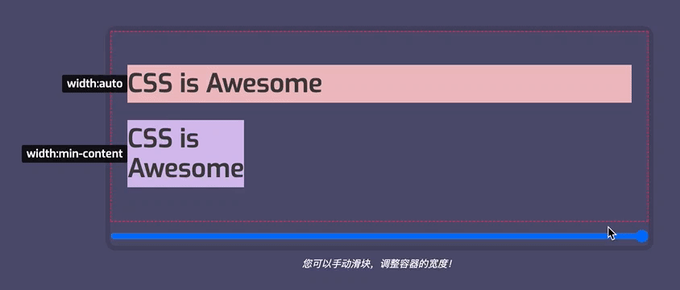

> Demo 地址： <https://codepen.io/airen/full/gOzGLYo>

从上图中不难发现，`width` 取值为 `min-content` 时，`h1` 的宽度始终是单词“**Awesome**”长度（大约是 `144.52px`）。它的宽度和容器宽度变化并无任何关系，但它受排版内相关的属性影响，比如 `font-size` 、`font-family` 等。

注意，如果 `h1` 元素内有一个后代元素显式指定了一个固定值，且该元素的宽度大于或等于 `min-content`，那么 `min-content` 将会与这个元素宽度相等。

再来看 `max-content` ：

```
/* 外在尺寸 */
.item {
    width: auto;
}

/* 内在尺寸 */
.item {
    width: min-content;
}

.item {
    width: max-content;
}
```

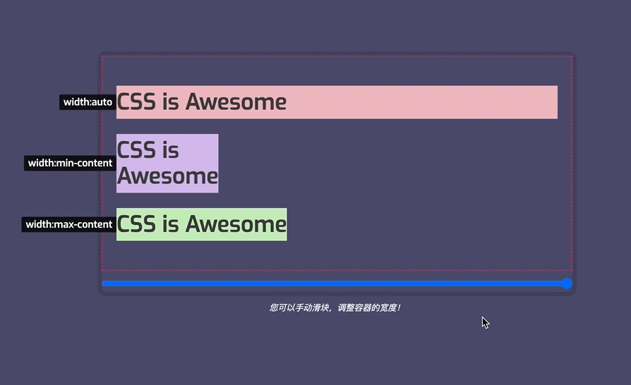

> Demo 地址： <https://codepen.io/airen/full/jOxGVEd>

当 `h1` 的 `width` 取值为 `max-content` 时，它的宽度是 `h1` 所在行所有内容的宽度（有点类似于元素加了 `white-space: nowrap` ，强制不断行时的长度）。最后再来看 `fit-content` ：

```
/* 外在尺寸 */
.item {
    width: auto;
}

/* 内在尺寸 */
.item {
    width: min-content;
}

.item {
    width: max-content;
}

.item {
    width: fit-content;
}
```

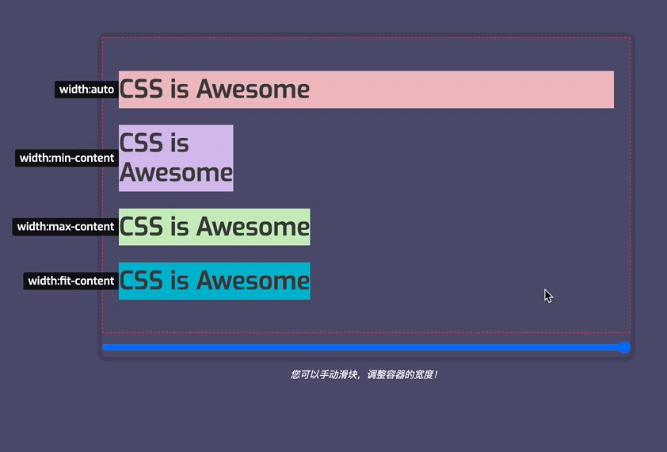

> Demo 地址： <https://codepen.io/airen/pen/zYZvGrY>

相对而言，`fit-content` 要比 `min-content` 和 `max-content` 复杂得多：

```
h1 {
    width: fit-content;
    
    /* 等同于 */
    width: auto;
    min-width: min-content;
    max-width: max-content;
}
```

简单地说，`fit-content` 相当于 `min-content` 和 `max-content`，其取值：

-   如果元素的可用空间充足，`fit-content` 将使用 `max-content` ；

<!---->

-   如果元素的可用空间不够允足，比 `max-content` 小点（介于 `min-content` 至 `max-content` 之间），那就是用可用空间的值，不会导致内容溢出；

<!---->

-   如果元素的可用空间很小，比 `min-content` 还小，那就使用 `min-content`。

使用下图来描述它们之间的关系：


`min-content` 、`max-content` 和 `fit-content` 它们是属性值，可以被运用于 CSS 的尺寸属性上，比如 `width` 、 `height` 、`inline-size` 和 `block-size` 。同样的，它们也可以用在 `flex-basis` 属性上。

```
.item:has(img) {
    flex-basis: var(--flex-basis, auto)
}
```

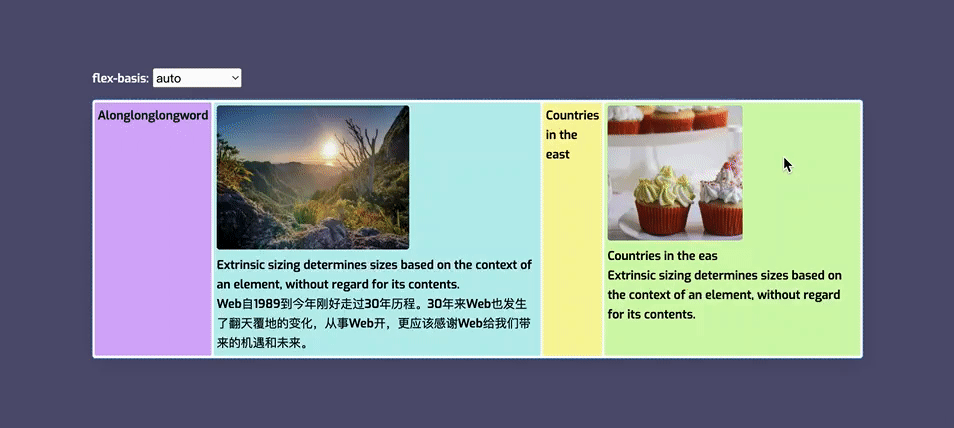

> Demo 地址： <https://codepen.io/airen/full/VwxMPPq>

简单小结一下。`flex-basis` 可以因设置的值不同，所起的功效也将有差异，大致可以分为：

-   默认值：`auto` ，根据内容来计算；

<!---->

-   固定值：`<length>` ，数值加上固定单位的长度值，比如 `100px` 、`100pt` ；

<!---->

-   相对值：`<length-percentage>` ，数值加上相对单位的值，比如 `10rem` 、`10em` 、`10ch` 、`10ex` 、`10vw` 、`10vh` 和 `10%` ；

<!---->

-   动态计算值：使用 `calc()` 、`min()` 、`max()` 和 `clamp()` ，比如 `calc(100% - var(--sidebar-width))` 、`clamp(10rem, 10rem + 2vw, 30rem)` ；

<!---->

-   内在尺寸：`min-content` 、`max-content` 和 `fit-content` 。


> Demo 地址： <https://codepen.io/airen/full/JjvrEVx>

## flex-basis 的计算

现在你已经知道了，在 Flexbox 布局中，`flex-basis` 是用来初始化 Flex 项目尺寸的，即 **初始化 Flex 项目的主尺寸（Main Size）** ，也被称为“**假设主尺寸** ”。初始设置的 `flex-basis` 值并不是 Flex 项目的最终主尺寸，因为影响其最终尺寸的因素较多，比如，Flex 容器的剩余空间（或不足空间）、Flex 项目的扩展因子（`flex-grow` 属性的值 ）、Flex 项目的收缩因子（`flex-shrink`）、Flex 项目的最小值（`min-*`）和最大值（`max-*`），以及 `flex-basis` 的初始值等等。

简单地说，`flex-basis` 的计算分为两个部分。

-   由 Flex 容器空间（剩余空间或不足空间），`flex-grow` 、`flex-shink` 以及初始化 `flex-basis` 相关参数计算后的 `flex-basis` 值。这部分我们在前面的课程中介绍过了，可以阅读《[06｜Flexbox 中的计算：通过扩展因子比例来扩展 Flex 项目](https://juejin.cn/book/7161370789680250917/section/7161623797794078750)》和《[07｜Flexbox 中的计算：通过收缩因子比例收缩 Flex 项目](https://juejin.cn/book/7161370789680250917/section/7164357320367931399)》。

<!---->

-   指定 Flex 项目尺寸大小的相关属性权重的计算。

我们这里要和大家一起探讨的就是第二个部分，即 **指定 Flex 项目尺寸大小的相关属性权重的计算** 。也就是说，当 Flex 项目上同时出现 `flex-basis` 、`width` （或 `inline-size`）、`min-width` （或 `min-inline-size`）和 `max-width` （或 `max-inline-size`） 时，究竟是谁最有决定权。

> 需要特别声明的是，这部分的计算是指 Flex 项目的假设主尺寸，就是在参与 `flex-grow` 、`flex-shrink` 计算之前，Flex 项目的初始化尺寸由谁来决定。

事实上，在 Flexbox 布局模块 **初始化 Flex 项目的尺寸时存在一个隐式的公式** ，即：

> **`content`** ➜ **`width`** ➜ **`flex-basis`**

它的意思是，**如果 Flex 项目未显式指定** **`flex-basis`** **属性的值，那么** **`flex-basis`** **将回退到** **`width`** **属性；如果 Flex 项目同时都未显式指定** **`flex-basis`** **和** **`width`** **属性的值，那么** **`flex-basis`** **将回退到基于 Flex 项目的内容计算宽度** 。

不过，最终决定 Flex 项目尺寸大小时，还会受 `flex-grow` 和 `flex-shrink` 以及 Flex 容器大小的影响，并且 Flex 项目的最终尺寸也会受 `min-width` （或 `min-inline-size` )和 `max-width` （或 `max-inline-size` ）属性值的限制。

接下来用一个简单的示例来阐述 Flex 项目的内容（`content`）、`width` 以及 `flex-basis` 对 Flex 项目尺寸的影响。

```
<div class="container">
    <div class="item"><span>A</span>longlonglongword</div>
    <div class="item"><span>B</span>ook</div>
    <div class="item"><span>C</span>ountries</div>
    <div class="item"><span>D</span>iscuss</div>
    <div class="item"><span>E</span>astern</div>
</div>
```

```
.container {
  display: flex;
  inline-size: 1000px;
  outline: 2px dashed #09f;
  color: #000;
  font-size: 1.5rem;
  min-block-size: 200px;
}
```

示例中的 `.item` 并没有显式设置任何与尺寸有关的属性（比如 `width` ），也没有显式设置 `flex-basis` 属性的值。此时，浏览器会将 Flex 项目的 `flex-basis` 属性的值当作为 `auto` ，即：

```
.item {
    flex-basis: auto;
}
```

浏览器同时也会将 Flex 项目的 `width` 属性的值视为 `auto` ，即：

```
.item {
    flex-basis: auto;
    width: auto;
}
```

此时，每个 Flex 项目的初始化尺寸由其自身的内容来决定：

-   Flex 项目 A 的宽度约是 `237.56px`；

<!---->

-   Flex 项目 B 的宽度约是 `70.26px`；

<!---->

-   Flex 项目 C 的宽度约是 `120.56px`；

<!---->

-   Flex 项目 D 的宽度约是 `100.69px` ；

<!---->

-   Flex 项目 E 的宽度约是 `100.11px` 。

Flex 容器 `.container` 有足够多的空间来放置这些 Flex 项目：


> Demo 地址： <https://codepen.io/airen/full/BaxwRBx>

注意，所有 Flex 项目的 `flex-grow` 和 `flex-shrink` 都采用的是默认值，即：

```
.item {
    flex-grow: 0;
    flex-shrink: 1;
    flex-basis: auto;
    width: auto;
}
```

此时，Flex 项目的初始化尺寸就是 **Flex 项目自身内容（`content`）来撑开 Flex 项目（浏览器计算值）** 。它和 `fit-content` 的表现是极其相似的，Flex 容器有足够空间时，它的表现和 `max-content` 相似，反则它的表现和 `min-content` 相似。

不过，要是在 Flex 项目上重置了 `flex-shrink` 属性的值（显式设置为 `0` ），Flex 项目不可收缩，那么 `flex-basis` 和 `width` 取值为 `auto` 时，它的表现和 `flex-basis` 或 `width` 设置为 `max-content` 是相同的。


> Demo 地址： <https://codepen.io/airen/full/NWMagjx>

由此我们可以得到第一个结论：**如果 Flex 项目的** **`flex-basis`** **和** **`width`** **取初始值** **`auto`** **时，Flex 项目的初始化尺寸是** **`fit-content`** **；但当** **`flex-shrink`** **显式重置为** **`0`** **，Flex 项目不可收缩时，Flex 项目的初始化尺寸就是** **`max-content`** 。在这种条件之下，Flex 项目在根据 `flex-grow` 和 `flex-shrink` 比例重新计算 `flex-basis` 是最为复杂的，浏览器可能需要重复循环遍历的计算 `flex-basis` 的值。

接下来，显式地在 Flex 项目上给 `width` 指定一个值，比如 `150px` ：

```
.item {
    width: 150px;
    
    /* 等同于 */
    flex-grow: 0;
    flex-shrink: 1;
    flex-basis: auto;
}
```

将所有宽度为 `150px` 的 Flex 项目放到一个宽度为 `1000px` 的 Flex 容器中，Flex 容器有一定的剩余空间出现（即 `250px`）：


> Demo 地址：<https://codepen.io/airen/full/VwxMWVO>

在该示例中，Flex 项目的 `flex-basis` 没有显式指定，所以会取其默认值 `auto` ，这个时候会回到 `width` 属性的值，即 `150px` 。也就是说，Flex 项目的 `flex-basis` 初始化尺寸就等于 `width` 的值。这也印证了：

> **如果 Flex 项目未显式设置** **`flex-basis`** **属性的值，浏览器会采取 Flex 项目上的** **`width`** **属性的值** 。

你可能已经发现了，由于在 Flex 项目上设置的 `width` 值小于 Flex 项目的内容最小尺寸（`min-content`），将会造成 Flex 项目内容溢出，这和其他溢出容器的表现是一样的。而且 `flex-grow` 属性使用的也是其初始值 `0` ，所以 Flex 项目并不会去分配 Flex 容器的剩余空间，除非重置 Flex 项目的 `flex-grow` 值。

另外，当 Flex 容器有剩余空间时，即使 Flex 项目的 `flex-shrink` 值是 `1` （可收缩），Flex项目的宽度也不会产生变窄的现象（因为只有 Flex 容器空间不足时，Flex 项目才会按照 `flex-shink` 的比例因子缩小）。

接着再看另一种情景，当 Flex 项目上同时显式设置了 `width` 和 `flex-basis` 时，浏览器又会取哪个值作为 Flex 项目的初始化的宽度呢？比如下面这个示例：

```
.item {
    width: 150px;
    flex-basis: 100px;
    
    /* 等同于 */
    flex-grow: 0;
    flex-shrink: 1;
    flex-basis: 100px;
}
```


> Demo 地址： <https://codepen.io/airen/full/MWGOGwE>

正如你所见，如果 Flex 项目上同时显式设置了 `width` 和 `flex-basis` 值（非 `auto` 默认值）时，`flex-basis` 属性的值将会替代 `width` 的值。但是：

-   当 Flex 项目的 `flex-basis` 值小于 `width` 值，且 `width` 值小于 Flex 项目的内容最小值（`min-content`）时，Flex 项目的 `flex-basis` 的值会等于 `width` 属性值；

<!---->

-   当 Flex 项目的 `flex-basis` 值小于 `width` 值，但 `width` 值大于 Flex 项目的内容最小值（`min-content`）时，Flex 项目的 `flex-basis` 的值会等于 Flex 项目的内容最小值（`min-content`）；

<!---->

-   当 Flex 项目的 `flex-basis` 值大于 `width` 值，但小于 Flex 项目的内容最小值（`min-content`）时，Flex 项目的 `flex-basis` 的值会等于 `width` 属性值；

<!---->

-   当 Flex 项目的 `flex-basis` 值大于 `width` 值，且同时大于 Flex 项目的内容的最小值，Flex 项目的 `flex-basis` 值不会被任何其他值所替代。

虽然如此，但是在 Flex 项目上只要同时显式设置了 `flex-basis` 和 `width` 两属性的值，浏览器都将 Flex 项目的初始化尺寸（假想主尺寸）视为 `flex-basis` 的值。

```
.item {
    width: 150px;
    flex-basis: 100px;
}

/* 等同于 */
.item {
    flex-basis: 100px;
}
```

上面代码中，Flex 项目初始化的假想主尺寸都会是 `100px` ，也就是说，浏览器在根据 Flex 容器剩余空间（或不足空间）、Flex 项目的 `flex-grow` 或 `flex-shrink` 计算 `flex-basis` 最终值时，它（`flex-basis`）的最初基础都将是 `100px` ：


这也就是，**Flex 项目的总宽度（`width`属性值总和）大于 Flex 容器空间（即 Flex 容器产生不足空间），但 Flex 项目的** **`flex-basis`** **显式设置了** **`0`** **或** **`0%`** **时，即使 Flex 项目的** **`flex-shrink`** **（收缩因子）是非** **`0`** **的值，比如** **`1`** **或大于** **`1`** **的其他值，Flex 项目也不会按收缩比例分配 Flex 容器的不足空间。最终** **Flex 项目的** **`flex-basis`** **值等于 Flex 项目的内容最小尺寸（`min-content`）** 。


> Demo 地址： <https://codepen.io/airen/full/YzLELvX>

因此，**如果你要给 Flex 项目设置一个初始化的尺寸（一个假设的主尺寸或者说一个理想的尺寸），应该尽可能地在 Flex 项目使用** **`flex-basis`** **来设置这个初始化尺寸** 。这样做可以更直接地告诉浏览器，Flex 项目的初始化主尺寸有多大。因为浏览器在计算 Flex 项目的 `flex-basis` 最终值都和 Flex 项目的初始化的 `flex-basis` 值有关联。**这里是不是有一种此** **`flex-basis`** **非彼** **`flex-basis`** **的感觉** （绕晕没）！

在 Flexbox 布局中，只要给 Flex 项目显式设置了 `flex-basis` 的值，就有可能会造成 Flex 容器有剩余空间或不足空间。不过在默认情况之下，Flex 容器有剩余空间时，Flex 项目不会自动扩展，这是因为 Flex 项目的 `flex-grow` 默认值为 `0`，但 Flex 容器只要有不足空间，Flex 项目就会自动收缩，这是因为 Flex 项目的 `flex-shrink` 的默认值为 `1` 。

另外一点，Flexbox 布局中的 `flex-basis` 值，浏览器最终计算的 `flex-basis` 最终值也会像 `width` 属性一样，受 `min-width` （或 `min-inline-size`）、`min-height` （或 `min-block-size`）、`max-width` （或 `max-inline-size`）和 `max-height` （或 `max-block-size`）值的限制。

前面已经说过，在 CSS 中，如果元素同时出现 `width` 、`min-width` 和 `max-width` 属性时，其权重计算遵循以下规则：

-   如果元素的 `width` 值大于 `max-width` 值时，`max-width` 会覆盖 `width` 值，最终取 `max-width` 值；

<!---->

-   如果元素的 `width` 值小于 `min-width` 值时，`min-width` 会覆盖 `width` 值，最终取 `min-width` 值；

<!---->

-   如果 `min-width` 值大于 `max-width` 值时，`min-width` 的优先级将高于 `max-width` 值，最终会取 `min-width` 。

> 这些规则同样适用于 `height` 、`min-height` 和 `max-height` 以及它们对应的 CSS 逻辑属性！

那么在 Flex 项目上，同时出现 `width` 、`flex-basis` 和 `min-width` 时，具体的运算过程如下：

-   根据“`content` ➜ `width` ➜ `flex-basis`”法则，先判断出运用于 Flex 项目的初始化的值，即 `flex-basis` 会运用于 Flex 项目；

<!---->

-   再将计算出的 `flex-basis` 值和 `min-width` 值作比较，如果 `flex-basis` 值小于 `min-width` 值，则 Flex 项目的最终值为 `min-width` 值，即 **`min-width`** **值会覆盖** **`flex-basis`** **的值作为 Flex 项目的最终值** 。

比如：

```
.item {
    width: 150px;
    flex-basis: 100px;
    min-width: 180px;
}
```

最终所有 Flex 项目的初始化值（Base Size）是 `100px` ，最小值（Minimum Size）是 `180px` ，浏览器最终计算出来的 `flex-basis` 值也会是 `min-width` 值，即 `180px` ：


> Demo 地址： <https://codepen.io/airen/full/jOxaxjK>

如果 Flex 项目同时出现 `width` 、`flex-basis` 和 `max-width` 时，具体的运算过程如下：

-   根据“`content` ➜ `width` ➜ `flex-basis`”法则，先判断出运用于 Flex 项目的初始化的值，即 `flex-basis` 会运用于 Flex 项目；

<!---->

-   再将计算出的 `flex-basis` 值与 `max-width` 比较，如果 `flex-basis` 的值大于 `max-width` 值，则 `flex-basis` 的最终值是 `max-width` 值，即 **`max-width`** **值会覆盖** **`flex-basis`** **的值** 。

比如：

```
.item {
    width: 150px;
    flex-basis: 300px;
    max-width: 100px;
 }
```

最终所有 Flex 项目的初始化值（Base Size）是 `300px` ，最大值（Maximum Size）是 `100px` ，浏览器最终计算出来的 `flex-basis` 值也会是 `max-width` 值，即 `100px` ：


> Demo 地址： <https://codepen.io/airen/full/XWqzBJj>

如果 Flex 项目同时出现 `width` 、`flex-basis` 、`min-width` 和 `max-width` 时，会在上面的规则上增加新的一条规则来进行判断：

> **当** **`min-width`** **大于`max-width`时，`min-width`优先级将高于** **`max-width`** **。**

然后再与 `flex-basis` 的值相比，**`flex-basis`会取`min-width`** **值** 。反之，如果 `min-width` 小于 `max-width` 时，计算出来的 `flex-basis` 分别与 `min-width` 和 `max-width` 相比，如果小于 `min-width` 则取 `min-width` ，如果大于 `max-width` 则取`max-width` 。

比如：

```
.item {
    width: 150px;
    flex-basis: 300px;
    min-width: 120px;
    max-width: 100px;
 }
```


> Demo 地址：<https://codepen.io/airen/full/WNJXKGe>

如果你理解了的话，可以使用更简单的规则来决定 Flex 项目的尺寸。

> **首先根据** **`content`** **➜** **`width`** **➜** **`flex-basis`** **来决定用哪个值来初始化 Flex 项目的假设主尺寸。如果 Flex 项目显式设置了** **`flex-basis`** **属性，则会忽略** **`width`** **和** **`content`** **。但最终浏览器计算出来的 Flex 项目主尺寸（计算后的** **`flex-basis`** **属性的值）会受到 CSS 的** **`min-*`** **和** **`max-*`** **属性值的限制，其中** **`min-*`** **用来设置 Flex 项目的下限值，`max-*`用来设置 Flex 项目的上限值** 。

我们可以用一个简单的流程图来描述：


## Flex 项目的最小值（min-size）

在使用 Flexbox 布局的时候，很有可能其中某个 Flex 项目的文本内容很长，最终导致内容溢出：


你可能想到了在文本节点容器（它也是一个 Flex 项目）上设置：

```
/* ① 长单词断行，常用西文 */
.long-word {
    overflow-wrap: break-word;
}

/* ② 文本截取，末尾添加 ... */
.text-overflow {
    white-space: nowrap;
    overflow: hidden;
    text-overflow: ellipsis;
}

/* ③ 多行文本截取，末尾添加... */
.line-clamp {
    --line-clamp: 1;
    overflow: hidden;
    text-overflow: ellipsis;
    display: -webkit-box;
    -webkit-line-clamp: var(--line-clamp);
    -webkit-box-orient: vertical;
}
```

诸如此类的操作，我们只是希望防止内容（或长单词破坏页面布局）。如下图所示：

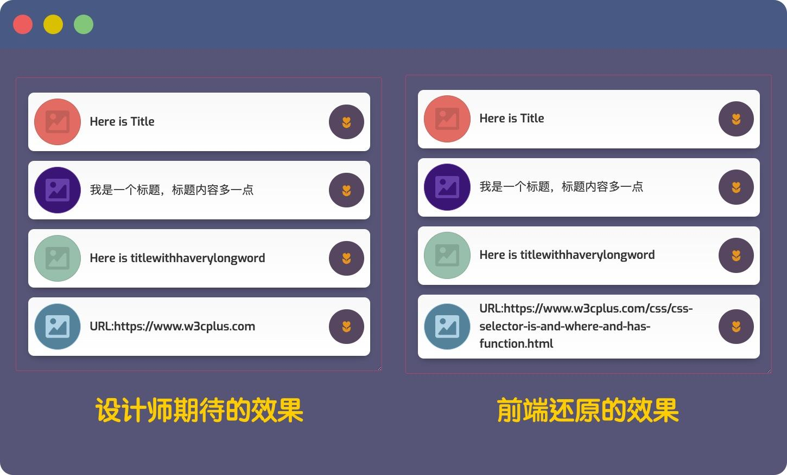

设计师期望卡片标题在同一行，不能因为内容过长而让设计效果失去一致性。为此，我们可以使用上面代码 ② 来截取文本，并且在文本末尾出现三个点的省略号：

```
.text-overflow {
    white-space: nowrap;
    overflow: hidden;
    text-overflow: ellipsis;
}
```

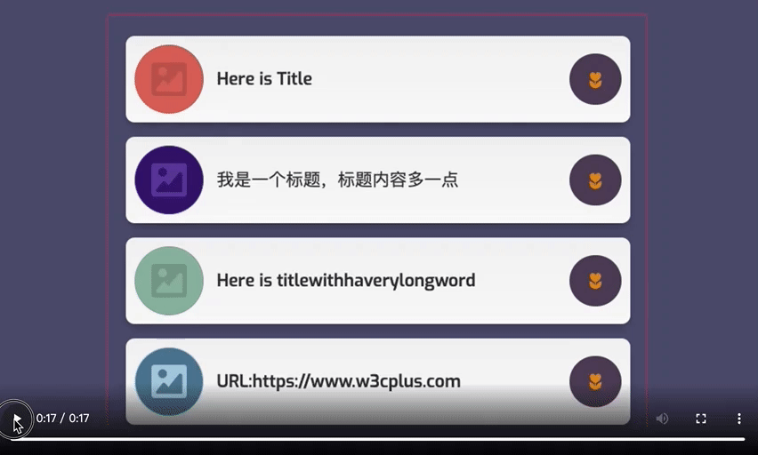

或者输入了恶意的内容，比如带下划线的URL或没有空格的数字，字母等：

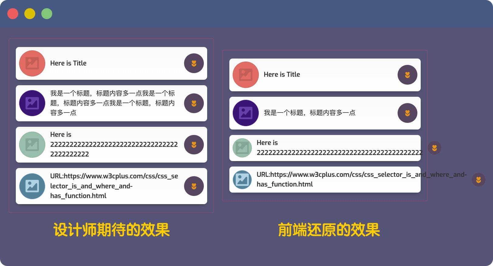

在这样的布局中，即使我们的标题元素是一个 Flex 项目，并且已显式设置了 `flex`：

```
 .card__title { 
     flex: 1 1 0%; 
 }
```

你会发现，卡片右侧的 Icon 还是被长内容挤出容器（溢出）：


你可能会想到，使用上面代码 ① 让长词断行显示：

```
.long-word { 
    overflow-wrap: break-word; 
 } 
```

你会发现，并未起效果：


即使你加了 `hyphens` 为 `auto` 也未生效。

你可能会认为它是一个 Flexbox 中的 Bug，事实上，[W3C规范中也有相应的描述](https://www.w3.org/TR/css-flexbox-1/#min-size-auto)：

> On a flex item whose overflow is visible in the main axis, when specified on the flex item’s main-axis min-size property, specifies an automatic minimum size.

大致意思上说：“**主轴上 Flex 项目的** **`overflow`** **属性是** **`visible`** **时，主轴上 Flex 项目的最小尺寸（min-size）将会指定一个自动的（automatic）最小尺寸** ”。前面我们也提到过：

> 默认情况下，Flex 项目（设置为 `flex:1` 的 Flex 项目）在收缩的时候，其宽度不会小于其最小内容尺寸（即 `min-content`）。**要改变这一点，需要显式设置** **`min-width`** **或** **`min-height`** **的值** 。

因此，我们要解决这个问题，需要在使用 `overflow-wrap` 为 `break-word` 的地方重置 `min-width` 值，并且强制它变成`0`：

```
.long-word { 
    overflow-wrap: 
    break-word; 
    min-width: 0; 
 } 
```

另外，要提出的是，Flex 项目的 `overflow` 的值为 `visible` 以外的值时会导致 `min-width` 的值为 `0`，这就是为什么在方法 ② 中做文本截取的时候，怎么没有 `min-width: 0`。

还有，Flex 项目的长文本（`max-content`）或显式设置 `white-space: nowrap` 在视觉上除了会打破布局之外，也会对相邻的 Flex 项目进行挤压，即使这些 Flex 项目显式设置了尺寸。比如上面的示例：

```
.card__media { 
    width: 4em; 
    aspect-ratio: 1; 
} 

.card__action { 
    width: 3em; 
    aspect-ratio: 1; 
} 
```

你会发现，后面三张卡片的左右两侧的 Flex 项目尺寸被挤压，甚至还会造成视觉上的变形：


造成这个现象是由于标题（它也是一个 Flex 项目）内容过长（`max-content`），Flexbox 容器无剩余空间来放置它，这个时候将会对同一轴上的其他 Flex 项目进行挤压。大家知道，Flex项目的 `flex` 的默认值为：

```
.item {
    flex-grow: 0;
    flex-shrink: 1;
    flex-basis: auto;
}
```

`flex-shrink` 的值为 `1`，表示 Flex 项目可以被收缩。解决这种现象，我们有两种方法，最简单的方法是在标题这个 Flex 项目元素上显式设置 `min-width` 的值为 `0`：

```
.card__title {
    min-width: 0;
}
```


另一种解法是在显式设置了 `width` 或 `height` 的 Flex 项目上重置 `flex-shrink` 的值为 `0`，告诉浏览器，即使 Flexbox 容器没有足够的剩余空间，你也不能来挤压我的空间：

```
.card__media, 
.card__action { 
    flex-shrink: 0; 
} 
```


相对而言，或者一劳永逸的方案是 **在显式设置了`flex: 1`的 Flex 项目的同时，也显式设置`min-width`的值为`0`** 。


> Demo 地址：<https://codepen.io/airen/full/NWMwLmX>

这里有一个小技巧，**Flexbox 布局中要实现均分列（等分列）布局效果时，请在 Flex 项目上显式设置** **`min-width`** **的值为** **`0`** **，避免因内容不等长，造成列不均等** 。

## 小结

现在我们明白了，Flex 项目上的 `width` 只是 `flex-basis` 缺失时的备用值，在代码中显式设置的 `flex-basis` 也只是你假想的一个主尺寸，它的最终值会根据 Flex 容器剩余空间（或不足空间）以及 Flex 项目的扩展因子（或收缩因子）而有所不同。并且最终计算出来的 `flex-basis` 会受到 `min-*` （Flex 项目的下限值）和 `max-*` （Flex 项目的上限值）限制。

你可能也已经注意到了，`flex-basis` 其实就是 **将 Flex 项目放入弹性容器之前的大小** 。这个值仅仅是一个理想或假设的值（即，开发者根据设计稿给 Flex 项目定义的一个最理想化的值）。但这个时候的值绝对不是 `flex-basis` 的最终值。因为 Flex 项目一旦放入 Flex 容器之后，Flex 项目的 `flex-basis` 就会发生变化，浏览器会根据相应的环境给 Flex 项目计算出一个最终的 `flex-basis` 值，而这个最终计算出来的 `flex-basis` 值也是 Flex 项目的最终尺寸（大小）。

现在我们明白了，这`width`只是`flex-basis`缺失时的后备，并且`min-width`和`max-width` 只是 `flex-basis` 的上限和下限。那么，`flex-basis` 究竟是什么？

在我们所有的插图中，我们在将 Flex 项放入 Flex 容器**之前将它们的大小可视化。** 我们这样做是因为`flex-basis`就是：**将弹性项目放入弹性容器之前的大小**。这是物品的理想或假设尺寸。但`flex-basis`不是**保证尺寸**！一旦浏览器将项目放入其 Flex 容器中，情况就会发生变化。

在我们上面的一些示例中，你看到弹性项目完全适合它们的弹性容器，因为所有项目的总和最终`flex-basis`是我们容器的确切宽度（1000px）。`flex-basis`发生这种情况时这很好，但通常弹性容器没有足够的空间，或者在其所有项目的值加起来之后会有额外的空间。

所以说，最终决定 Flex 项目大小的会由 **Flex 容器的剩余空间（或不足空间）** 、**Flex 项目的理想主尺寸（Flex 项目的初始化值）** 、**Flex 项目的扩展因子** （`flex-grow` 值）或 **Flex 项目的收缩因子** （`flex-shrink` 值）、 **Flex 项目的最小内容（或最大内容）长度值** 以及 **Flex 项目的下限值（`min-*`值）和（或）Flex 项目的上限值（`max-*`值）** 来决定。