Grid 布局指的是 **CSS Grid Layout** ，它和以往 CSS 框架（CSS Framework）中所说的网格系统（Grid System）有所不同。至今为止，它是唯一一个具有二维能力的布局系统，即，**它是一个基于二维网格的布局系统** ，与过去任何 Web 布局系统相比，它完全改变了我们设计用户界面的方式。

CSS 一直被用来给 Web 页面布局，但它一直以来做得都不怎么很好。首先，我们使用了表格（`table`），然后浮动（`float`）、定位（`position`）和内联块（`display: inline-block`）等给 Web 页面布局，但所有这些方法本质上都是一种 CSS Hack 手段，比如浮动的设计是用来给文本排版的，表格是用来数据展示的。而且以往的布局技术还遗漏了许多重要的功能，比如等高布局、水平垂直居中等。

> 有关于 Web 布局发展史，可以阅读前面的课程《[01｜Web 布局技术演进：了解 Web 布局发展史](https://juejin.cn/book/7161370789680250917/section/7161370789768347685) 》。

当然，近十年 Flexbox 成为主流布局技术，它很强大，但它依然是一维布局，在构建一些 Web 布局时，它还是有自身的局限性。

就 Web 布局而言， CSS Grid 才是第一个专门为解决布局问题而创建的 CSS 模块，自从有 Web 以来，我们就一直在破解这些布局问题。

## 什么是网格布局？

网格是由一系列水平与垂直的线构成的一种布局模式。你可以在网格的基础上，将设计元素进行排列，帮助你设计一系列具有固定位置以及尺寸的元素的页面，使我们的 Web 页面更加统一。

早前在 CSS 中并没有内置的网格系统，但对于 Web 设计师和开发者而言，对网格系统并不会感到陌生。因为设计师和开发者都熟悉（或有使用过）网格系统，比如 960gs 网格系统：


从上图中不难发现，一个网格有着它自己独特的特性和具备的属性，比如一个网格通常具有许多的 **列（Column）**  与 **行（Row）** ，以及行与行、列与列之间的间距，也称 **沟槽（Gutter）** 。


随着技术不断的革新，CSS 也具有内置的网格系统，也被称为**原生的 CSS 网格系统** ，要比使用其他各种技术创建的网格状（比如前面课程中所介绍的 Flexbox 创建网格系统）的设计更强。毕竟其他技术只具备一维方向（要么是行，要么是列）能力，而原生网格系统具备二维方向的能力，可以同时是行和列。

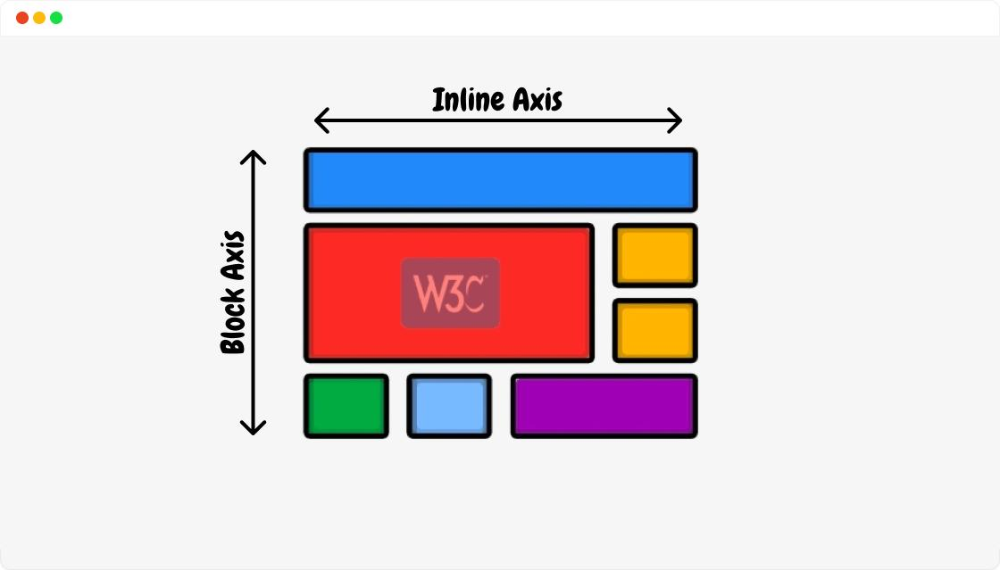

CSS 内置的网格系统除了是一个具有二维布局的系统之外，还具有以下这些特性。

- **固定的和弹性的轨道（行或列）尺寸** ：可以使用固定的轨道尺寸创建网格，比如我们熟悉的固定单位 `px` ，也可以使用百分比 `%` 或者网格系统中独有的弹性单位 `fr` 创建具有弹性尺寸的网格轨道，也可以两者相互结合来创建网格。
- **网格项目放置** ：可以使用网格线的数字索引号，或网格线名称，或者网格区域来精确放置网格项目。网格同时还使用一种算法来控制未给出明确网格位置的网格项目。
- **创建额外的网格轨道来放置网格项目** ：可以使用网格布局定义一个显式网格，但根据规范它会处理你加在网格外的内容，当必要时它会自增网格轨道，来尽可能多地容纳所有网格项目。
- **对齐控制** ：网格布局系统中也涵盖了对齐（Box Alignment）模块的部分特性，便于我们控制网格项目或网格轨道在内联轴或块轴方向的对齐。
- **控制层叠内容** ：一个网格单元或网格区域中可以放置多个网格项目，并且它们可以部分相互重叠，而且可以通过 `z-index` 属性来控制它的层级权重。
- **网格的嵌套（或子网格）** ：网格布局和早期的表格布局非常的相似，在网格布局中还可以让网格与网格相互嵌套，甚至还可以使用子网格。
- **网格顺序** ：在网格布局中，除了通过网格线或网格区域来调整网格顺序之外，还可以像 Flexbox 布局中一样，使用 `order` 属性来调整网格项目的排列顺序。

这里可能提到一些网格布局的专业术语或独有的术语，如果希望彻底了解或掌握 CSS 的网格布局，这些术语是我们必须得掌握的，它们是网格布局中最基础的部分。

## 网格布局术语

网格布局的出现，同时也给布局方面带来一堆新的技术术语。其中最为主要的原因是 Grid 布局才是真正意义上的 Web 布局。

### 坐标轴

我们都知道，在 Web 布局中有自身的坐标轴存在，最早分为水平（`x`）轴和垂直（`y`）轴，但在 Flexbox 布局中，它新增了主轴（Main Axis ）和侧轴（Cross Axis），而且这两个轴由 CSS 的 `flex-direction` 属性来决定。不过，在 CSS 的网格布局中，主要以内联轴（Inline Axis）和块轴（Block Axis）来定义 Web 的坐标轴。即：

- **块方向的列轴** ，即块轴（Block Axis）；
- **文字方向的行轴** ，即内联轴（Inline Axis）。

块方向的轴是采用块布局时块的排序方向。假设页面中有两个段落（`<p>`）元素，其中一个显示在另一个下面，所以这个方向的轴被称为**块方向的轴** 。在 CSS 网格布局系统中，它被称为**列轴（Column）** ，因为这条轴的方向和列轨道的方向是一致的。

行方向的轴与块方向的轴垂直，它的方向和普通文本的方向一致。在 CSS 网格布局中，很多时候也被称为**行轴（Row）** ，因为这条轴的方向和行轨道是一致的：

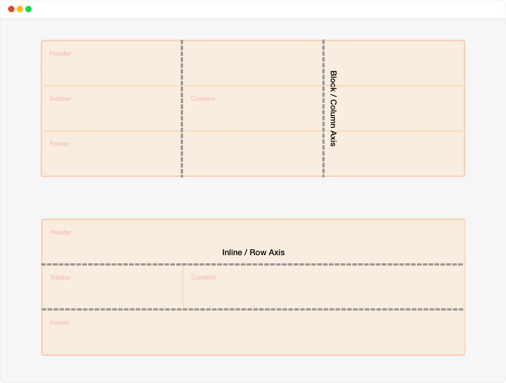

> 需要注意的是，CSS 中的行轴（Row）和列轴（Column）也会受书写模式和阅读模式的影响。

### 网格容器和网格项目

我们都知道了，在 Flexbox 布局中，显式声明了 `display` 属性的值是 `flex` 或 `inline-flex` 的元素被称为 Flex 容器，该元素的直接子元素（包括其伪元素和文本节点）都被称为 Flex 项目。同样的，在 CSS 的网格布局中，显式声明了  `display` 属性的值为 `grid` 或 `inline-grid` 的元素被称为 **网格容器（Grid 容器）** ，该元素的直接子元素（包括其文本节点和伪元素）都被称为**网格项目（Grid 项目）** 。

比如：

```HTML
<div class="container">
    <div class="item">item</div>
</div>
.container {
    display: grid; /* 或者 inline-grid */
}
```

示例中的 `.container` 显式设置了`display` 的值为 `grid` 或 `inline-grid` ，此时它就是一个 Grid 容器，同时也创建了 一个网格格式化上下文（Grid Formatting Content，即 GFC）。其子元素 `.item` （也可以是 `.container` 元素的文本节点或其伪元素 `::before` 或 `::after` ）自动就变成了网格项目。

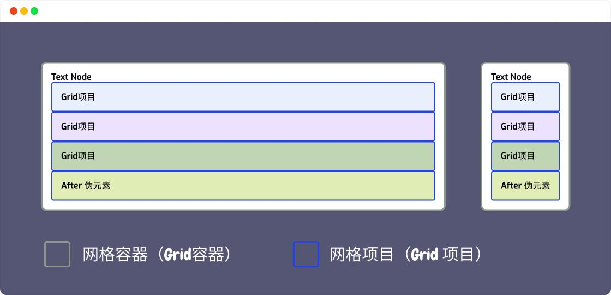

> Demo 地址：https://codepen.io/airen/full/YzLveVB

同样的，如果在网格项目上显式设置 `display` 的值为 `grid` 或 `inline-grid` ，它就既是一个网格容器也是一个网格项目。 

> **注意，默认情况下，显式设置 `display` 的值为** **`grid`** **或** **`inline-grid`** **时，就会自动创建一个** **`1 x N`** **的网格（一列N行的网格），其中** **`N`** **由网格容器的子元素、文本节点和伪元素决定** 。

### 网格线

CSS 的网格是一组相交的**水平（行）** 和**垂直（列）** 的网格线组成，它将网格容器的空间划分为网格区域（最小的网格区域就是一个独立的网格单元格），可以将网格项目放入其中。可以说，网格线是网格布局中很重要的部分，它主要分为两组网格线，即：

- 一组定义沿块轴（Block Axis）运行的列， 也称为列网格线；
- 一组定义沿内联轴（Inline Axis）运行的行，也称为行网格线。

这两组网格线成正交的模式。这两组网格线也是构成网格结构的分界线，可以是水平的，也可以是垂直的。它们可以是位于行或列的任何一边。

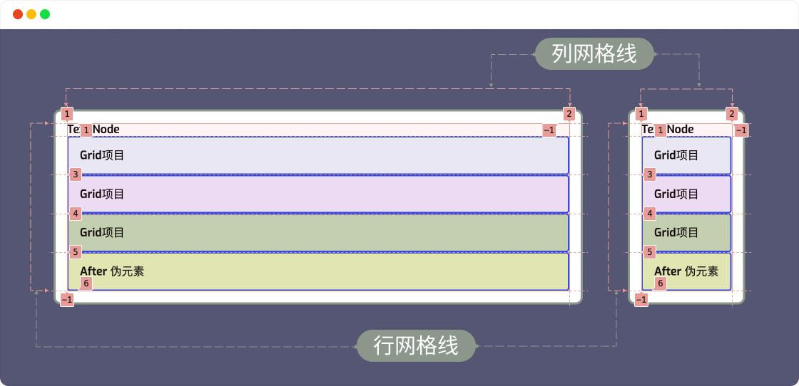

CSS 网格布局中的网格线可以用数字索引（如上图中的数字）或开发者指定的名称来表示。比如下面这个示例，左侧的示例使用网格线来定位一个网格项；右侧的示例使用显式命名的网格线来定位一个网格项： 

```CSS
.grid__container { 
    display: grid; 
    gap: 10px; 
} 

.grid__container:nth-child(1) { 
    grid-template-columns: 150px 1fr; 
    grid-template-rows: 100px 1fr 80px; 
} 

.grid__container:nth-child(1) .grid__item:nth-child(3) { 
    grid-column: 2; 
    grid-row-start: 1; 
    grid-row-end: 4; 
} 

.grid__container:nth-child(2) { 
    grid-template-columns: 150px [item1-start] 1fr [item1-end]; 
    grid-template-rows: [item1-start] 100px 1fr 80px [item1-end]; 
} 

.grid__container:nth-child(2) .grid__item:nth-child(3) { 
    grid-column: item1-start / item1-end; 
    grid-row: item1-start / item1-end; 
 } 
```

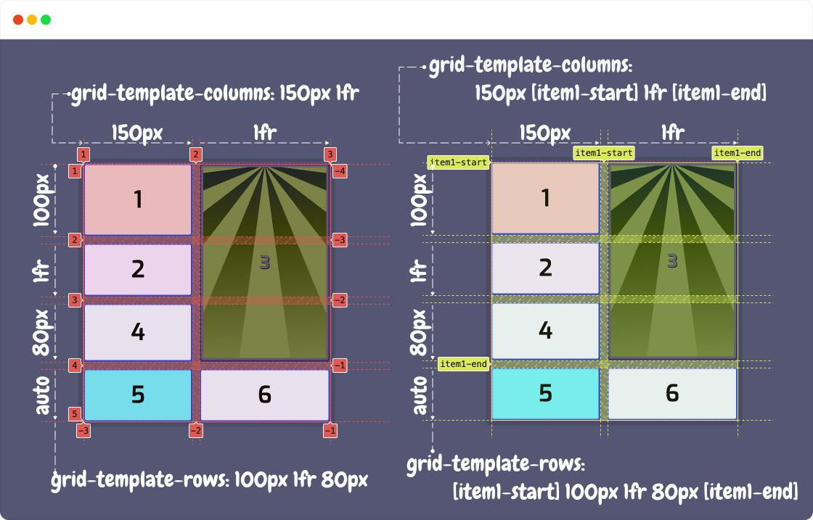

> Demo 地址：https://codepen.io/airen/full/abGKYyr

正如你所见，网格布局中未显式给网格线命名的情况下，默认是以数字索引号命名，并且从`1` 开始叠加，同时它的反方向则从 `-1` 开始命名。其默认索引号会受 CSS 的书写模式 `writing-mode` 影响，但不受 `direction` 属性的影响：


而且，网格线的数量是由网格轨道来决定的：

- 列网格线数量由 `grid-template-columns` 来决定；
- 行网格线数量由 `grid-template-rows` 来决定。

需要注意的是，使用 `grid-template-columns` 、`grid-template-rows` 以及 `grid-template-areas` 属性定义的网格线名称，都被称为显式网格线名称。也就是说，在 CSS 网格中还有隐式被命名的网格线名称。可以使用 `grid-row` 、`grid-column` 或 `grid-area` 将网格项目放置在显式网格之外时创建的网格线，被称为隐式网格线名称，它们会在显式网格线上累加。

### 网格单元格

网格中 **相邻的两条行和列网格线所围绕着的区域，被称为网格单元格** （有点类似于表格单元格），它是网格中的最基本单位（空间）。网格单元格可以被用来放置网格项目。如下图所示，行网格线 `1` 和 `2` ，列网格线 `1` 和 `2` 相交构建的区域就是一个网格单元格（图中斜线区域）：

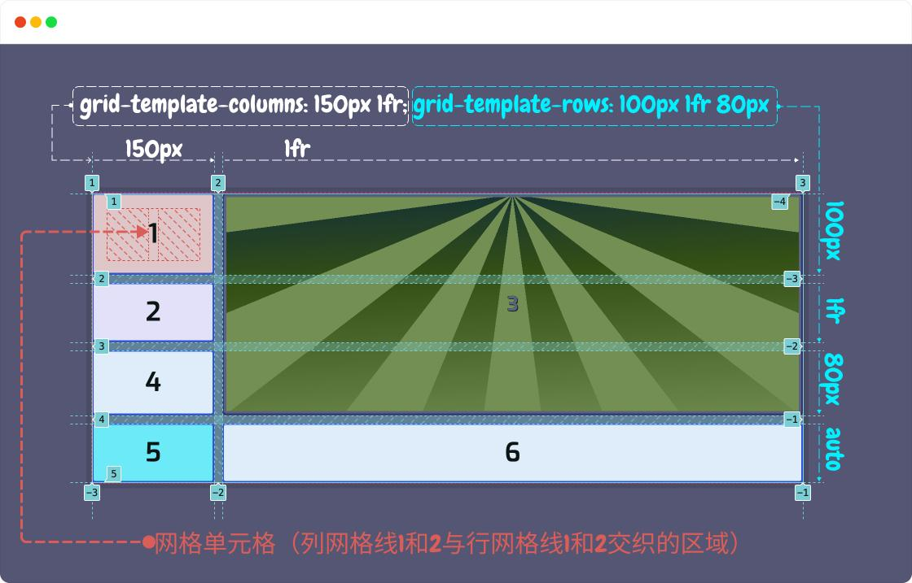

### 网格轨道

网格轨道是 CSS Grid 布局中独有的一种术语，把网格中的列和行统称为网格轨道。换句话说，它是两条相邻网格线之间的空间。每个网格轨道都有一个尺寸，它控制着网格的列宽或行高，从而控制着它的边界网格线（相邻两条网格线）之间的距离，这个网格距离也称为网格轨道尺寸。另外，相邻网格线可以用网格沟槽（即 `gap` 属性）来隔开，但在其他情况下，会被紧紧地贴在一起。

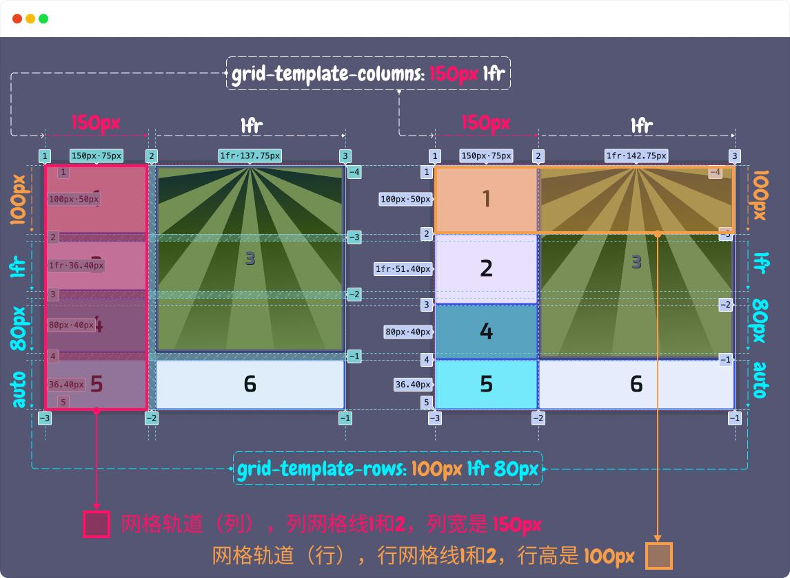

Grid 布局中的网格轨道尺寸是由 `grid-template-columns` 和 `grid-template-rows` 属性来指定的，其中：

- `grid-template-columns` 指定列网格轨道尺寸，即列宽；
- `grid-template-rows` 指定行网格轨道尺寸，即行高。

另外，还可以使用 `grid-auto-columns` 和 `grid-auto-rows` 属性来指定隐式网格轨道尺寸：

- `grid-auto-columns` 指定隐式列网格轨道尺寸；
- `grid-auto-rows` 指定隐式行网格轨道尺寸。

### 网格区域

网格区域是由四条网格线所包围的空间构成，网格区域的每边各一条，并参与它所交汇的网格轨道的大小。简单地说，它是由一个或多个相邻的网格单元格组成。其中一个单元格是网格中最小的一个网格区域。

网格区域的作用和网格单元格一样，主要用来放置一个或多个网格项目的逻辑空间。它可以使用 `grid-template-areas` 属性显式命名，然后使用 `grid-area` 来引用已命名好的网格区域，还可以通过它的边界网格线隐式引用。比如下面这个示例，左侧是由 `grid-template-areas` 命名定义的网格区域，右侧是由网格线隐式创建的网格区域：

```HTML
<div class="container">
    <header class="item header">Header Area</header>
    <main class="item main">Main Area</main>
    <nav class="item nav">Nav Area</nav>
    <aside class="item aside">Aside Area</aside>
    <footer class="item footer">Footer Area</footer>
</div>
```

```CSS
.container {
    display: grid;
}

/* 使用 grid-template-areas 命名网格区域 */
.container:nth-child(1) {
    grid-template-areas:
        "header header header"
        "aside  main   nav"
        "footer footer footer" 
}

/* 根据网格区域名称放置网格项目 */
.container:nth-child(1) .header {
    grid-area: header;
}
.container:nth-child(1) .aside {
    grid-area: aside;
}
.container:nth-child(1) .main {
    grid-area: main;
}
.container:nth-child(1) .nav {
    grid-area: nav;
}
.container:nth-child(1) .footer {
    grid-area: footer;
}

/* 使用 grid-template-columns 定义一个网格, 由网格线隐式创建网格区域 */
.container:nth-child(2) {
    grid-template-columns: 150px 1fr 150px;
}

/* 根据网格线放置网格项目 */
.container:nth-child(2) .header {
    grid-area: 1 / 1 / 2 / 4;
}

.container:nth-child(2) .main {
    grid-area: 2 / 2 / 3 / 3;
}

.container:nth-child(2) .aside {
    grid-area: 2 / 1 / 3 / 2;
}

.container:nth-child(2) .footer {
    grid-area: 3 / 1 / 4 / 4;
}
```


> Demo 地址：https://codepen.io/airen/full/GRdYrpL

### 显式网格和隐式网格

网格布局中的网格系统可以为分 **显式网格** 和 **隐式网格** 。这两者的区别主要是创建网格的方式不同，简单地说，如果使用 `grid-template-rows` 、`grid-template-columns` 或 `grid-template-areas` 属性创建的网格，我们称之为 **显式网格（Explicit Grid）**。 

只不过，这三个属性（`grid-template-rows` 、`grid-template-columns` 和 `grid-template-areas`）创建的网格可能不是最终网格。它可能因为网格项目被放置到显式网格之外而变大，在这种情况下，将会自动创建隐式网格线，同时会生成隐式网格轨道（`grid-auto-rows` 、`grid-auto-columns` 或 `grid-auto-flow` 等属性决定）。此时，新增的隐式网格轨道和最初已创建的显式网格轨道组合在一起，重新创建新的网格，这个新网格被称为**隐式网格（Implicit Grid）** 。

来看一个简单示例：

```HTML
<div class="container">
    <div class="item">1</div>
    <div class="item">2</div>
    <div class="item">3</div>
    <div class="item">4</div>
    <div class="item">5</div>
    <div class="item">6</div>
    <div class="item">7</div>
    <div class="item">8</div>
    <div class="item">9</div>
    <div class="item">10</div>
    <div class="item">11</div>
</div>
```

```CSS
.container {
    display: grid;
    grid-template-columns: repeat(3, 100px);
    grid-template-rows: repeat(2, 100px);
    grid-auto-rows: 60px;
    gap: 10px;
}

.item:nth-child(3) {
    grid-area: 1 / 4 / 4 / 5;
}

.item:nth-child(4) {
    grid-area: 1 / -5 / 4 / 1;
}
```

在这个示例中，通过 `grid-template-columns` 和 `grid-template-rows` 创建了一个两行三列的网格，并且行网格轨道和列网格轨道的尺寸都是 `100px` 。此时，这个两行三列的网格就是一个显式网格。

由于这个显式网格是一个两行三列（只有六个网格单元格）的网格，默认情况之下（即按照自动放置网格项目的算法）只能放置六个网格项目，但示例中有十一个网格项目，比默认多出五个网格项目。这个时候，浏览器会自动将多余的网格项目按行增加，这主要是因为 `grid-auto-flow` 属性的默认值为 `row` ，加上我们显式设置了 `grid-auto-rows` 值为 `60px` ，这样就告诉浏览器自动新增网格行轨道的尺寸是 `60px` 。

就该示例而言，此时自动新增了两个行网格轨道，即创建了一个“四行三列”的隐式网格：


另外，该示例的第三个网格项目和第四个网格项目还使用了 `grid-area` 属性，将网格项目放置到显式网格之外：

```HTML
.item:nth-child(3) {
    grid-area: 1 / 4 / 4 / 5;
}

.item:nth-child(4) {
    grid-area: 1 / -5 / 4 / 1;
}
```

这样一来，`grid-area` 在原显式网格基础上又新增了两列（隐式的列），最终它们一起创建了一个“三行五列”的隐式网格：

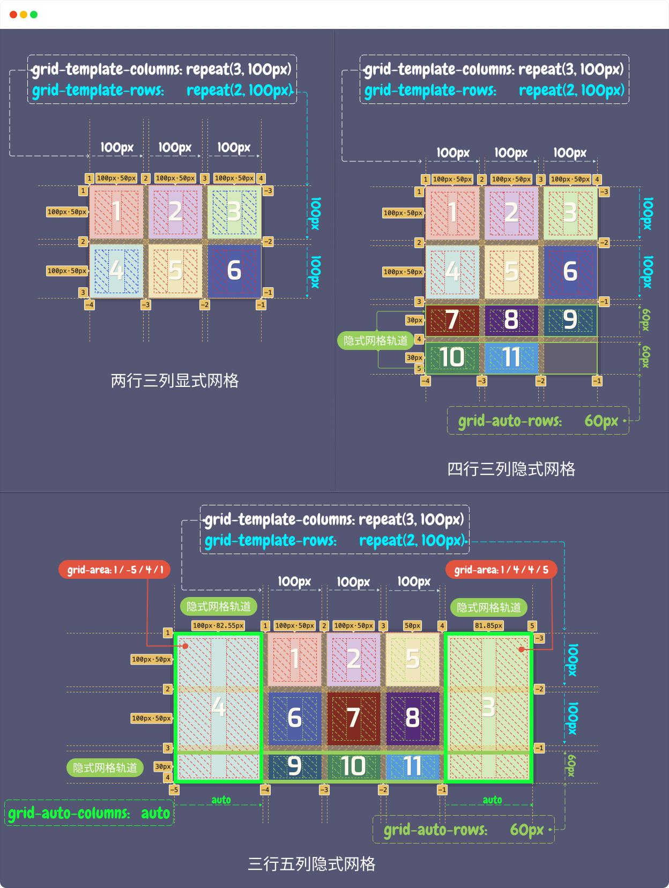

> Demo 地址： https://codepen.io/airen/full/eYrPvVX

事实上呢，示例中提到的仅仅是创建隐式网格最常见的两种方式，除此之外还有其他的一些方式也可能创建隐式网格。如下图所示，图中黑色虚线是显式网格，红色虚线是隐式网格：


也就是说，在 CSS 网格布局中，网格容器的 `grid-template-rows` 、`grid-template-columns` 和 `grid-template-areas` 属性，定义了显式网格的固定数量的网格轨道。当网格项目被定位在这些界限之外时，网格容器会通过向网格添加隐式网格线来生成隐式网格轨道。这些网格线与显式网格线一起构建了隐式网格。

另外，网格容器的 `grid-auto-rows` 和 `grid-auto-columns` 属性对这些隐式网格轨道以及由 `grid-template-areas` 创建但未被 `grid-template-rows` 和 `grid-template-columns` 明确调整大小的任何显式网格轨道进行调整。

同时，网格容器的 `grid-auto-flow` 属性控制没有明确位置的网格项目的自动放置。一旦显式网格被（网格项目）填满（或没有显式网格），自动放置也会创建隐式网格。或者可以这样来理解：

- `grid-template-rows` 、`grid-template-columns` 和 `grid-template-areas` 定义显式网格；
- `grid-template-rows` 和 `grid-template-columns` 可以用来指定显式网格轨道固定数量和网格轨道尺寸；
- `grid-auto-rows` 、`grid-auto-columns` 和 `grid-auto-flow` 定义隐式网格；
- `grid-auto-rows` 和 `grid-auto-columns` 可以用来指定隐式网格轨道尺寸；
- `grid-row` 、`grid-column` 和 `grid-area` 将网格项目放置在显式网格之外，也会创建隐式网格。

### 网格间距（沟槽）

网格布局中，相邻两网格轨道之间有时候会有一定的间距，那么这个间距称之为 **网格间距** ，也称为 **沟槽** 。它主要分为：

- **行间距** ：相邻的两个行网格轨道之间的间距；
- **列间距** ：相邻的两个列网格轨道之间的间距。

你要以使用 `gap` 属性来设置网格轨道之间的间距，其中：

- `column-gap` 用来设置列网格轨道之间的间距；
- `row-gap` 用来设置行网格轨道之间的间距。

```CSS
.container {
    --row-gap: 10px;
    --column-gap: 10px;
    gap: var(--row-gap) var(--column-gap);
}
```

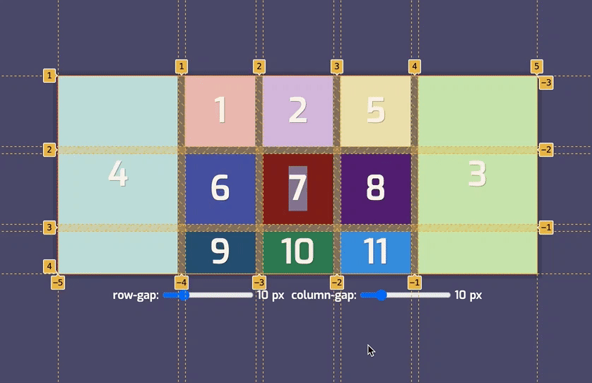

> Demo 地址： https://codepen.io/airen/full/qBYJmex

### 嵌套网格

“嵌套网格”从字面上就不难理解，就是网格中嵌套了网格，有点类似于表格嵌套表格的意思。

在网格布局中，网格项目也可以同时成为一个网格容器，即在网格项目上显式设置 `display` 属性的值为 `grid` 或 `inline-grid` 。比如：

```HTML
<!-- HTML --> 
<div class="grid__container"> 
    <div class="grid__item"></div> 
    <div class="grid__item grid__container--sub"> 
        <div class="grid__item grid__item--sub"></div> 
        <!-- Sub Grid Item --> 
        <div class="grid__item grid__item--sub"></div> 
    </div> 
    <!-- Grid Item --> 
    <div class="grid__item"></div> 
</div>
```

```CSS
.grid__container { 
    display: grid; 
    grid-template-columns: repeat(3, 1fr); 
    gap: 10px; 
} 

.grid__item:nth-child(1) { 
    grid-area: 1 / 1 / 4 / 2; 
} 

.grid__item:nth-child(2) { 
    grid-area: 1 / 2 / 2 / 4; 
}
```

在这个示例中，`.grid__container` 是一个网格容器，在其第二个网格项目中（`.grid__container--sub`）包含了几个子元素（`.grid__item--sub`），这几个元素并不是 `.grid__container` 的直接子元素，因此它们不是网格项目，也就不会参与到网格布局当中：


如果将 `.grid__container--sub` 设置的 `display: flex` 值更改为 `display: grid` （或 `inline-grid`）。这个时候，`.grid__container--sub` 就从当初的 Flexbox 容器变成了网格容器，其子元素 `.grid__item--sub` 就变成了网格项目（包括 `.grid__container--sub` 的伪元素）： 

```CSS
.grid__container--sub { 
    display: inherit;               /* 继承其父元素的 display 属性的值 */
    grid-template-columns: inherit; /* 继承其父元素的 grid-template-columns 属性的值 */
    gap: 15px; 
}
```


> Demo 地址： https://codepen.io/airen/full/bGMmRWV

这个示例中，嵌套网格（`.grid__container--sub`）和它的父容器（`.grid__container`，也是一个网格容器）并没有关系。这两个网格容器是两个独立的网格，有自己的网格系统，比如说，网格线、网格轨道等。其中 `.grid__container--sub` 既是网格项目，也是网格容器。

### 子网格

首先要注意的是，网格布局中的**子网格（Subgrid）** 和**嵌套网格（Nested Grid）** 并不是同一个东西。网格布局中的子网格是`grid-template-rows` 和 `grid-template-columns` 属性的一个值，即 `subgrid` ：

```CSS
.sub--grid {
    display: inherit;
    grid-template-columns: subgrid;
    grid-template-rows: subgrid;
}
```

CSS 子网格（`subgrid`）是指跨越网格区域的网格项目显式地设置 `grid-template-rows` 或（和）`grid-template-columns` 属性的值是 `subgrid` 。这样一来，子网格就会继承父网格的特性，比如网格轨道尺寸、间距等。在 CSS 网格布局中，一般只将跨越网格区域的网格项目（即合并列或行的网格项目）定义成子网格，只有当网格项目跨越多个网格单元格时，子网格（`subgrid`）才有意义。

默认情况之下，网格项目的子项目（子元素）不是网格布局的一部分。如果没有子网格功能，就需要创建一个嵌套网格，正如上面介绍的“嵌套网格”所说的那样，如果你想为嵌套网格复制网格布局，就需要重新计算网格轨道。这个新增的子网格功能和嵌套网格最大的不同之处是，**子网格继承了其父网格的网格轨道，并与之无缝对接，同时子网格功能还能增强网格项目的能力** 。

来看一个子网格（`subgrid`）相关的示例：

```CSS
.grid__container { 
    display: grid; 
    grid-template-columns: repeat(3, 1fr); 
    gap: 10px; 
} 

.grid__item.grid__container--sub { 
    grid-area: 1 / 2 / 2 / 4; 
} 

.grid__container--sub { 
    display: inherit; /* 继承其父元素 display 的值，这里相当于 display: grid */
    grid-template-columns: subgrid; 
 }
```

 

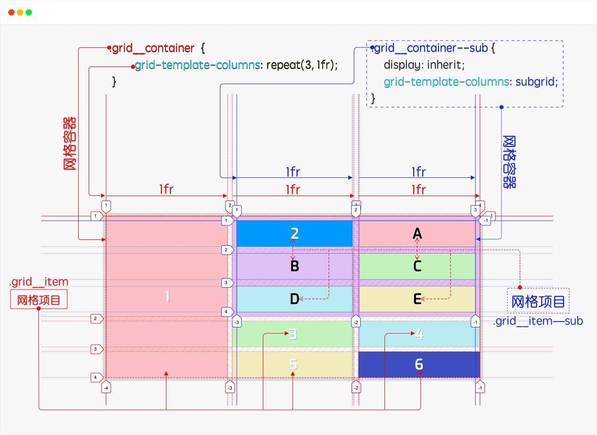

> Demo 地址： https://codepen.io/airen/full/oNdawEJ （请使用 Firefox 浏览器查看）

网格项目 `.grid_container--sub` （它同时是 `.grid__container` 子元素）中使用 `grid-area` 将两列合并成一个单元格（也可以使用 `grid-column` 和 `grid-row` 达到同等效果），同时在该元素上显式设置了 `display: inherit`，用来继承其父元素的 `display` 的值。

此时该元素也变成了一个网格容器，其所有子元素 `.grid__item--sub` 和 伪元素 `::before` 就变成了网格项目，而且在该元素上显式设置了 `grid-template-columns: subgrid`。这样做可以让其继承父网格布局的特性，比如网格线名称、网格轨道等。

从渲染的结果你会发现，相当于设置了 `grid-template-columns: repeat(2, 1fr)`: 

```CSS
.grid__container--sub { 
    display: inherit; 
    grid-template-columns: repeat(2, 1fr); 
} 
```

事实上，子网格和嵌套网格有明显的差异，其中子网格具有以下特性： 

- 继承父网格命名的网格线 ；
- 继承父网格指定的网格区域 ；
- 继承父网格的网格间距（网槽）； 
- 可以定义自己的命名网格线，并将其添加到父网格的命名网格线中 ；
- 可以定义自己的命名网格区域，并将其添加到父网格的命名网格区域中 ； 
- 可以覆盖继承的网格间距 。

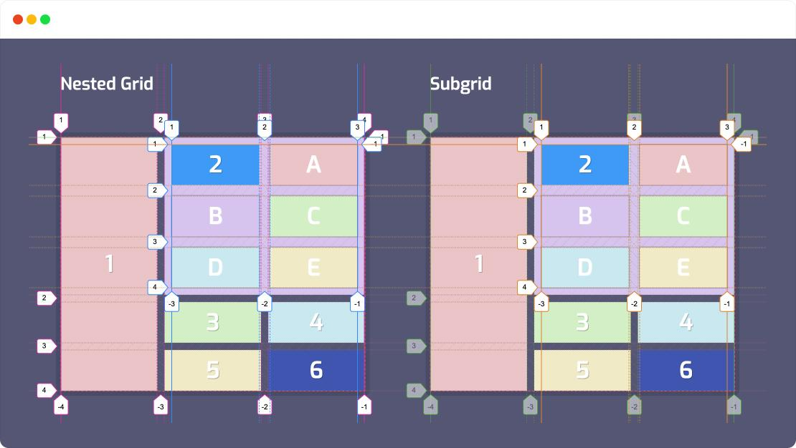

> Demo 地址： https://codepen.io/airen/full/Rwyegeb

## 网格布局中的属性

可用于网格布局中的 CSS 属性可以像 Flexbox 布局一样，分为 **可用于网格容器的属性** 和 **可用于网格项目的属性** 。其中可用于网格容器上的属性较多，如下图所示：


但总体而言分为两个部分，其中一部分是用来创建（或定义）网格的，比如 `grid-template-*` 和 `grid-auto-*` 等；另外一部分是用来设置网格对齐方式的，比如 `justify-content` 、`align-content` 等。

用于网格项目的属性要少得多，主要有 `grid-row` （分为 `grid-row-start` 和 `grid-row-end`）、`grid-column` （分为 `grid-column-start` 和 `grid-column-end`）、`grid-area` 等属性，它们主要用来放置网格项目位置的。还有就是用来设置网格项目对齐方式的，比如 `justify-self` 和 `align-self` 等。

## 网格容器尺寸

网格容器的尺寸，是使用它所参与的格式化上下文的规则来确定的：

- 作为一个块格式化上下文中的块级框，它的尺寸与建立格式化上下文的块级框一样，与非替换的块级框一样计算自动内联尺寸 ；
- 作为一个内联格式化上下文中的内联级框，它的尺寸与原子内联级框（内联块）一样，在内联和块格式化上下文中，网格容器的自动块尺寸是其最大内容的大小（`max-content`）。 

> **一个网格容器的最大内容尺寸（****`max-content`****）或最小内容尺寸（****`min-content`****）是该网格容器在适当的轴上的轨道尺寸（包括网格沟槽）的总和** 。 

简单地说，网格容器的尺寸可以像其它容器元素一样，使用尺寸相关的属性（比如 `width`、`max-width`、`min-width`、`height`、`max-height`、`min-height`以及其对应的逻辑属性）来设置。比如： 

```CSS
.grid__container { 
    --grid: grid; 
    --width: 40; 
    --height: 30; 
    display: var(--grid); 
    grid-template-columns: repeat(3, 200px); 
    gap: 10px; 
    width: calc(var(--width) * 1vw); 
    height: calc(var(--height) * 1vh); 
    overflow: auto; 
} 
```

就该示例而言，我们在网格容器上显式设置了 `width` 和 `height` ，同时使用 `grid-template-columns` 指定了每列列宽是 `200px`，每行行高根据网格项目自身内容高度尺寸来决定。示例中的网格容器的 `width` 值有可能小于三列加沟槽的总和（此例是 `620px`），也有可能大于它们的总和： 

- 当 `width` 小于 `620px` 时，网格容器会出现水平滚动条（因为容器显式设置了`overflow: auto`） ；
- 当 `width` 大于 `620px` 时，网格容器会有空白空间留出 。

网格容器的高度和宽度类似，只不过没有使用 `grid-template-rows` 属性来显式指定每行的高度，而是由网格项目盒模型自身决定。你将看到的效果如下： 

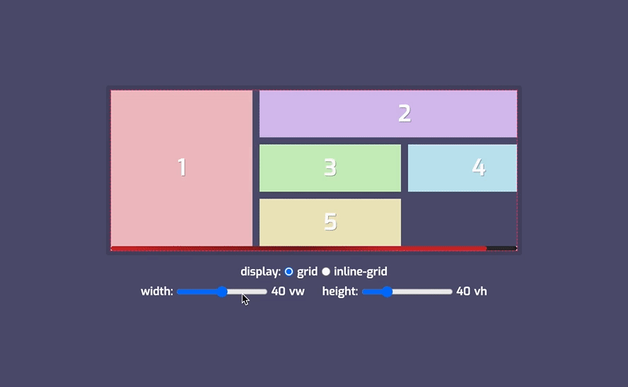

> Demo 地址：https://codepen.io/airen/full/vYjVJeK

除此之外，我们还可以通过 `grid-template-columns` 和 `grid-template-rows` 以及 `gap` 等属性来控制网格容器的尺寸： 

```CSS
.grid__container { 
    --col-1: 100; 
    --col-2: 100; 
    --col-3: 100; 
    --row-1: 50; 
    --row-2: 50; 
    --row-3: 50; 
    
    display: grid; 
    grid-template-columns: calc(var(--col-1) * 1px) calc(var(--col-2) * 1px) calc(var(--col-3) * 1px); 
    grid-template-rows: calc(var(--row-1) * 1px) calc(var(--row-2) * 1px) calc(var(--row-3) * 1px); 
    gap: 10px; 
} 
```


> Demo 地址： https://codepen.io/airen/full/wvjYqxp

## 网格项目的尺寸

在网格布局中，除了 `grid-template-columns` 、`grid-template-rows` 和 `grid-template-areas`， 以及 `grid-column` 、`grid-row` 和 `grid-area` 等属性可以决定网格项目尺寸之外，还可以在网格项目中使用尺寸属性，比如 `width` 和 `height` 来设置网格项目的尺寸。

除此之外，网格项目的尺寸还会受设置在网格项目上的对齐属性，比如 `align-self` 和 `justify-self` 的影响。有关于这方面更详细的介绍，将会在后面介绍网格对齐方式的课程中介绍。

## 小结

我想你现在对 CSS 的网格布局有最基础的认识了。了解到了网格布局是什么，以及网格布局中独有的一些技术术语和相关概念。

到目前为止，你可能还不知道如何使用 CSS 网格布局技术来给 Web 布局，不过不用担心，在下一节课程中我们开始真正进入 CSS 网格布局的实践中。我们将会先从定义（创建）网格开始，由浅入深地了解和掌握 CSS 网格是如何来构建 Web 布局的。